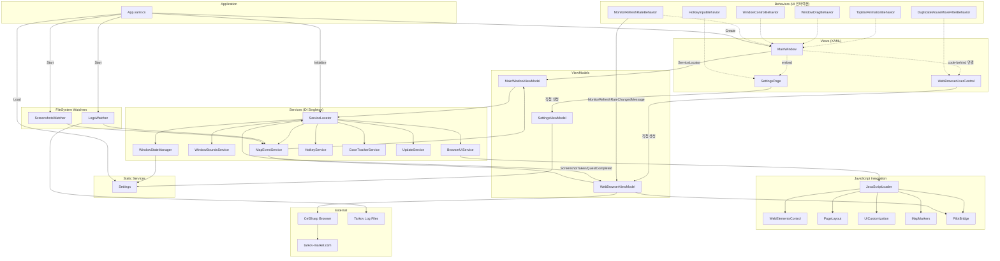
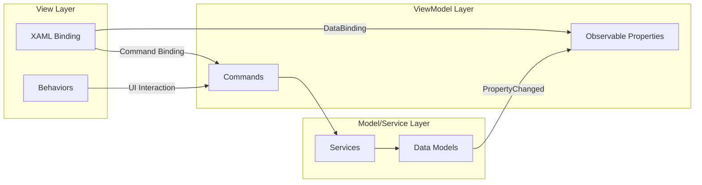
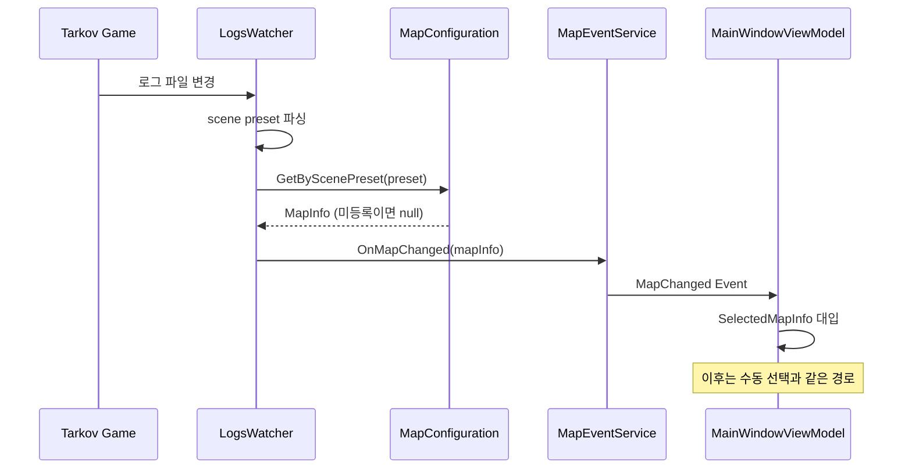
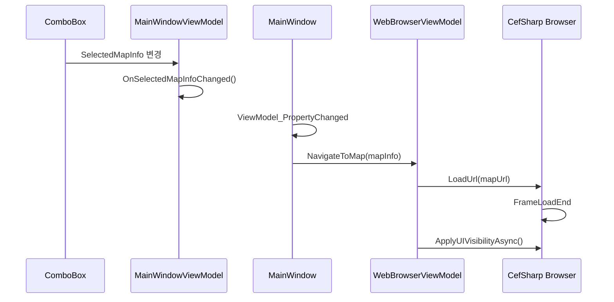
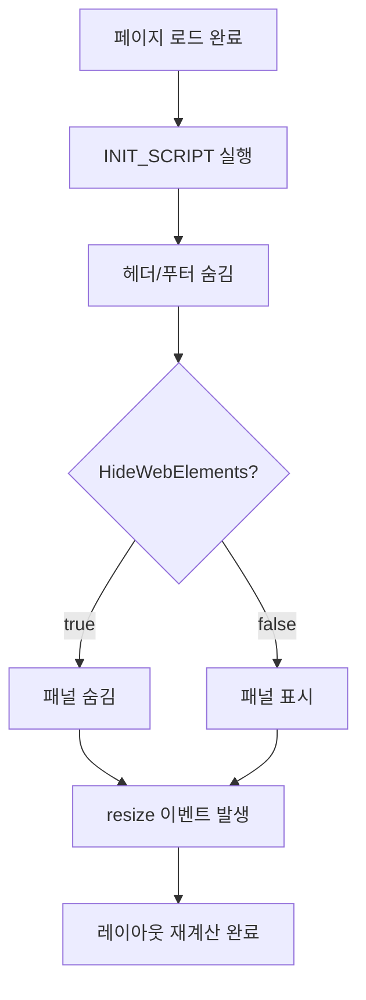
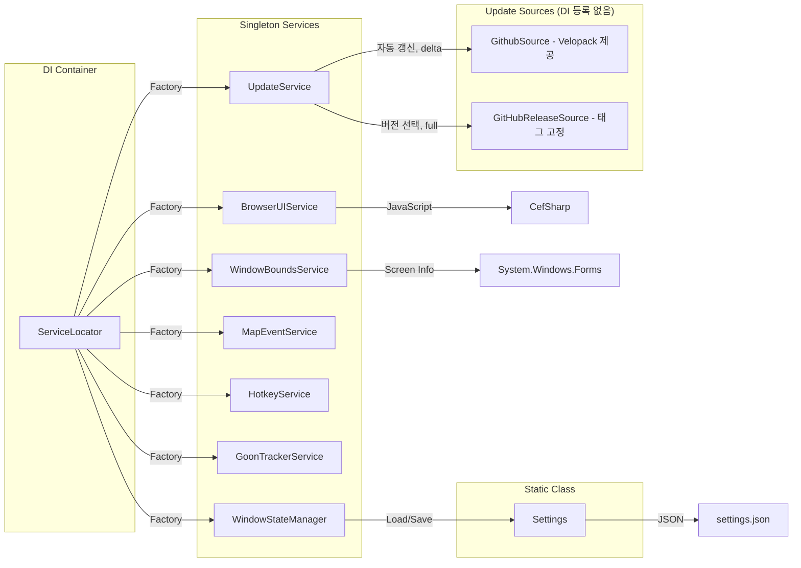
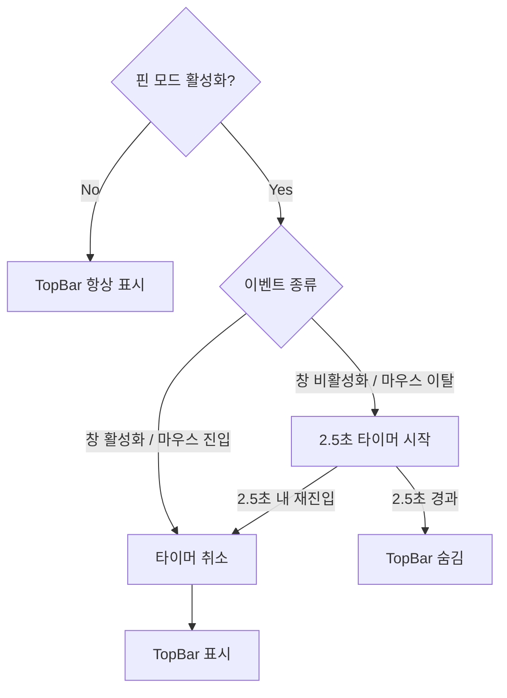
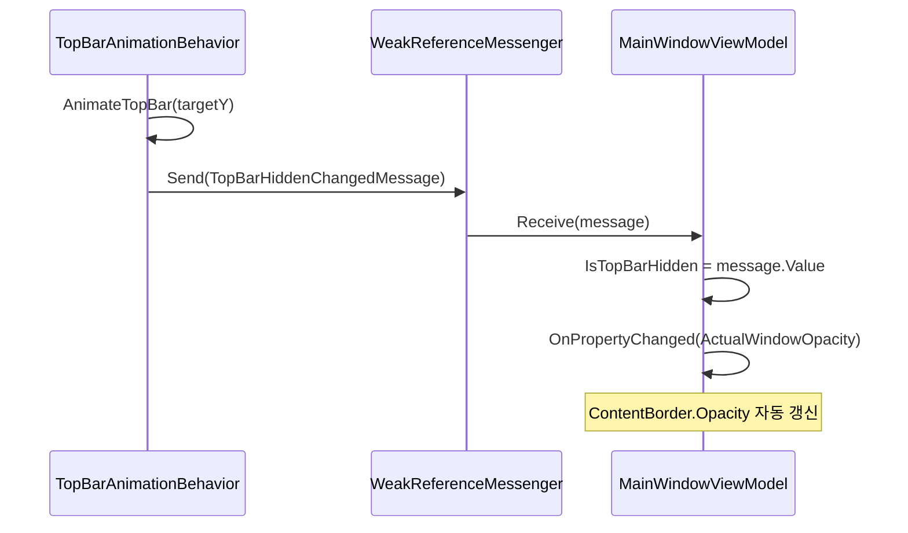

# TanukiTarkovMap 프로젝트 설계 문서

## 개요

Escape from Tarkov 게임을 위한 인터랙티브 맵 뷰어 애플리케이션입니다.
CefSharp를 통해 tarkov-market.com의 맵을 표시하며, 게임 로그 감시를 통한 자동 맵 전환 기능을 제공합니다.

---

## 아키텍처 다이어그램

### 전체 구조



### MVVM 데이터 흐름



### 맵 전환 시퀀스

#### 자동 맵 전환 (Tarkov 로그 감지)



#### 수동 맵 선택 (UI 드롭다운)



### UI 요소 숨기기 흐름



### 서비스 의존성



---

## 기술 스택

| 항목 | 기술/라이브러리 |
|------|-----------------|
| UI Framework | WPF (Windows Presentation Foundation) |
| Target Framework | .NET 8.0 |
| 웹뷰 | CefSharp.Wpf.NETCore |
| DI/IoC | Microsoft.Extensions.DependencyInjection |
| MVVM | CommunityToolkit.Mvvm |
| JSON | Newtonsoft.Json |
| 시스템 트레이 | Hardcodet.NotifyIcon.Wpf |

---

## 핵심 속성 (MainWindowViewModel)

```csharp
// 모드 상태
bool IsAlwaysOnTop        // 핀 모드 (TopMost)
bool IsTopmost            // 실제 TopMost 상태 (바인딩용)

// 핫키 설정
bool HotkeyEnabled        // 핫키 활성화 여부
string HotkeyKey          // 핫키 키 (기본: F11)

// UI 설정
bool HideWebElements      // 웹 UI 요소 숨김 여부
bool IsPmcExtraction      // Extraction 필터 (true=PMC, false=SCAV)

// 창 투명도
double WindowOpacity      // 사용자 설정 투명도 (0.1 ~ 1.0)
bool IsTopBarHidden       // TopBar 숨김 상태
double ActualWindowOpacity // 실제 적용 투명도 (계산됨)
                          // TopBar 보임 → 1.0
                          // TopBar 숨김 → WindowOpacity
```

---

## 프로젝트 구조

```
src/TanukiTarkovMap/
├── Models/
│   ├── Data/           # 데이터 모델 (MapInfo, Settings 등)
│   ├── FileSystem/     # 파일 시스템 감시 (LogsWatcher, ScreenshotsWatcher)
│   ├── JavaScript/     # CefSharp JavaScript 통합
│   ├── Services/       # 비즈니스 로직 서비스
│   └── Utils/          # 유틸리티 (Logger, HotkeyManager 등)
├── ViewModels/         # MVVM ViewModel
├── Views/              # WPF XAML 뷰
├── Converters/         # WPF Value Converters
└── Resources/          # XAML 리소스 (스타일)
```

---

## 서비스 아키텍처

### ServiceLocator 패턴

모든 서비스는 `ServiceLocator`를 통해 DI 컨테이너로 관리합니다.

```csharp
// 서비스 접근
ServiceLocator.BrowserUIService
ServiceLocator.WindowBoundsService
ServiceLocator.MapEventService
ServiceLocator.WindowStateManager
ServiceLocator.HotkeyService
ServiceLocator.GoonTrackerService
ServiceLocator.UpdateService
```

### 주요 서비스

| 서비스 | 역할 |
|--------|------|
| `BrowserUIService` | CefSharp UI 요소 가시성 제어 |
| `WindowBoundsService` | 창 경계 체크 및 화면 내 위치 보정 |
| `WindowStateManager` | 창 상태 저장/복원 |
| `MapEventService` | 맵 변경, 스크린샷, 퀘스트 완료 이벤트 발행 |
| `HotkeyService` | 전역 단축키 등록 및 토글 처리 (HotkeyManager 래핑) |
| `GoonTrackerService` | Goons 출몰 맵 주기 조회 (tarkov-goon-tracker.com) |
| `UpdateService` | Velopack 업데이트 (백그라운드 자동 갱신, 설정에서 고른 버전 설치) |
| `Settings` | 애플리케이션 설정 로드/저장 (JSON) |

`UpdateService`는 두 경로를 함께 다룹니다. 자동 갱신은 Velopack의 `GithubSource`를 그대로 써서 delta를 받고, 사용자가 버전을 직접 고르는 경로는 `GitHubReleaseSource`를 씁니다. `GitHubReleaseSource`는 DI에 등록하지 않고 설치할 때마다 대상 태그에 고정해 새로 만드는 업데이트 소스로, 그 이유는 [README의 버전 선택과 되돌리기](README.md#8-버전-선택과-되돌리기)에 적어 두었습니다. Velopack의 시작 시 자동 적용과 `ApplyUpdatesAndRestart`는 쓰지 않습니다. 둘 다 앱의 정상 종료 경로를 우회할 수 있으므로, 다운로드한 패키지는 `App`이 CEF를 닫은 뒤 `WaitExitThenApplyUpdates`로만 적용합니다.

업데이트 확인은 메인 창을 띄운 **뒤에** 시작합니다. 시작을 막지 않는 것이 이 앱에서는
다른 무엇보다 앞서기 때문이며, 그렇게 정한 근거와 뒤집을 조건은
[시작 속도와 업데이트 시점](docs/20260816-startup-speed-and-updates.md)에 적어 두었습니다.

full과 delta 중 무엇을 받을지, 배포 구조가 그 판단을 어떻게 제약하는지, 데이터
마이그레이션과 다운그레이드가 어떻게 얽히는지는 [업데이트 전달 설계](docs/20260816-update-delivery-design.md)에
정리해 두었습니다. 구현을 바꾸기 전에 그 문서의 결정 표와 전환 신호를 먼저 봅니다.

### 서비스 생성자 규칙

```csharp
// internal 생성자로 외부 new 방지
internal ServiceName() { }

// ServiceLocator에서 Factory 패턴으로 생성
services.AddSingleton(_ => new ServiceName());
```

---

## 이벤트 흐름

### 맵 자동 전환

```
타르코프 로그 파일 변경
       ↓
  LogsWatcher 감지 (scene preset 파싱)
       ↓
  MapConfiguration.GetByScenePreset() -> MapInfo
       ↓
  MapEventService.OnMapChanged(mapInfo)
       ↓
  MainWindowViewModel.OnMapEventReceived()
       ↓
  SelectedMapInfo 대입 -> MapSelectionChangedMessage
       ↓
  CefSharp URL 변경
```

### 맵 자동 전환 (스크린샷 보정)

레이드 도중 앱을 켜면 진입 로그가 이미 지나가 위 경로가 발동하지 않습니다.
스크린샷은 인게임에서만 생성되므로 이를 신호로 삼아 보정합니다.

```
스크린샷 파일 생성
       ↓
  ScreenshotsWatcher 감지
       ↓
  LogsWatcher.LastDetectedMap (초기 읽기 구간에서 기억해 둔 마지막 맵)
       ↓
  MapEventService.OnMapChanged(mapInfo)
       ↓
  MainWindowViewModel.OnMapEventReceived()
       ↓
  이미 같은 맵이면 중단, 아니면 위와 같은 경로로 전환
```

### 스크린샷 위치 표시와 퀘스트 완료 (window.pilot 브리지)

좌표 파싱과 마커 표시는 tarkov-market이 하므로, 앱은 사건만 웹 페이지로 넘깁니다.
넘기는 통로는 사이트가 페이지마다 열어 두는 `window.pilot`입니다.

```
스크린샷 파일 생성 / 퀘스트 완료 알림 로그
       ↓
  ScreenshotsWatcher / LogsWatcher 감지
       ↓
  MapEventService.OnScreenshotTaken(filename) / OnQuestCompleted(questId)
       ↓
  WebBrowserViewModel.SendToPilot() (UI 스레드로 마샬링)
       ↓
  PilotBridge 호출문 -> CefSharp EvaluateScriptAsync
       ↓
  window.tanukiPilot -> window.pilot.positionFromScreenshot / questComplete
```

`window.tanukiPilot`은 페이지가 로드될 때마다 `PilotBridge.INIT_SCRIPT`로 다시 등록합니다.
2026-08-17 Pilot v2 이전에는 포트 5123의 WebSocket 서버로 같은 사건을 넘겼으나, 사이트가
로컬 앱에 접속하지 않게 되어 이 경로로 옮겼습니다. 무엇이 깨졌고 어떤 대안을 버렸는지,
사이트가 또 바꿨을 때 어떻게 알아차리는지는 [Pilot 연동과 위치 전달 경로](docs/20260817-pilot-bridge.md)에
정리해 두었습니다. 이 경로를 고치기 전에 그 문서의 대안 비교와 전환 신호를 먼저 봅니다.

---

## 설정 파일 구조

`settings.json` 위치: `%APPDATA%\TanukiTarkovMap\settings.json`

사용자 폴더 경로는 모두 `AppPaths`가 정합니다. 설정과 브라우저 캐시는 생명주기가 반대라 서로 다른 폴더에 둡니다.

| 대상 | 폴더 | 이유 |
|------|------|------|
| 설정 | `%APPDATA%`(Roaming) | Velopack 설치 폴더 밖이라 앱을 제거해도 남고, 다시 설치하면 이어 씁니다 |
| 브라우저 캐시 | `%LOCALAPPDATA%\TanukiTarkovMap\Cache` | Velopack 설치 폴더 안이라 `Update.exe --uninstall`이 지울 때 함께 정리됩니다 |

0.1.0까지는 두 폴더가 반대였습니다. 예전 설정을 Local에서 Roaming으로 넘기는 규칙은 `SettingsLocationMigration`, 브라우저 프로필을 Roaming에서 Local로 넘기는 규칙은 `BrowserCacheLocationMigration`이 맡습니다. `AppPaths.PrepareOnStartup()`은 두 이전을 차례로 호출한 뒤 불어난 코드 캐시를 비웁니다. CEF가 캐시 폴더를 여는 순간 손댈 수 없으므로 `InitializeCef()`보다 먼저 호출해야 합니다.

브라우저 프로필 이전이 실패하면 그 실행의 `BrowserCacheFolder`는 예전 원본 경로를 가리킵니다. 실패 중 생긴 Local 대상은 지워 다음 시작에서 이전을 다시 시도하며, 빈 Local 폴더가 이전 완료 표시처럼 남지 않게 합니다.

### 브라우저 캐시 관리

캐시는 두 갈래로 쌓이고 성질이 달라 다르게 다룹니다. 실측한 값은 맵 하나를 처음 열 때 HTTP 캐시 21MB, 맵을 열 때마다 코드 캐시 0.8MB입니다.

| 갈래 | 쌓이는 방식 | 처리 |
|------|-------------|------|
| HTTP 캐시 (맵 타일) | 맵 종류만큼만 쌓여 스스로 포화 (11종 약 230MB) | 상한을 걸지 않습니다. 걸면 타일이 밀려나 매번 다시 받습니다 |
| 코드 캐시 (JS 바이트코드) | 맵을 열 때마다 늘어 상한이 없음 | `AppPaths.CodeCacheLimitMegabytes`를 넘으면 시작할 때 그 폴더만 비웁니다 |

사용자가 설정에서 캐시 전체를 비울 수도 있습니다. 실행 중에는 CEF가 프로필 파일을 붙들고 있어 지울 수 없으므로, 예약해 두었다가 `Cef.Shutdown()` 뒤에 지웁니다.

```json
{
  "NormalLeft": 100,
  "NormalTop": 100,
  "NormalWidth": 1000,
  "NormalHeight": 700,
  "HotkeyEnabled": true,
  "HotkeyKey": "F11",
  "IsAlwaysOnTop": false,
  "WindowOpacity": 1.0
}
```

---

## UI 요소 숨기기 로직

### 개념

tarkov-market.com 웹페이지의 UI 요소를 JavaScript로 제어해 맵만 깔끔하게 표시합니다.

### 요소 분류

| 요소 | 숨김 조건 | 복원 가능 |
|------|-----------| ----------|
| **헤더 (header)** | 항상 숨김 | X |
| **푸터 (footer-wrap)** | 항상 숨김 | X |
| **좌측 패널 (panel_left)** | 체크 시 숨김 | O |
| **우측 패널 (panel_right)** | 체크 시 숨김 | O |
| **상단 패널 (panel_top)** | 체크 시 숨김 | O |

### 동작 방식

```
페이지 로드 완료
       ↓
INIT_SCRIPT 실행 (함수들을 window 객체에 등록)
       ↓
헤더/푸터 항상 숨김 (window.hideHeader(), window.hideFooter())
       ↓
"UI 요소 숨기기" 체크 여부 확인
       ↓
  ┌─ 체크됨: 패널들도 숨김 (window.hidePanelLeft() 등)
  └─ 해제됨: 패널들 복원 (window.restorePanels())
       ↓
resize 이벤트 발생 → SVG 맵 레이아웃 재계산
```

### 핵심 원칙

1. **헤더/푸터는 항상 숨김**: 맵 이동, 체크 해제와 무관하게 절대 표시하지 않음
2. **패널만 토글 대상**: "UI 요소 숨기기" 체크박스는 좌/우/상단 패널에만 적용
3. **레이아웃 재계산**: 요소 숨김 후 `window.dispatchEvent(new Event('resize'))` 호출로 검은 영역 방지

### JavaScript 스크립트 구조

프로젝트의 JavaScript는 다음 패턴으로 관리됩니다:

```
Models/JavaScript/
├── Scripts/                      # 실제 JavaScript 파일 (Embedded Resource)
│   ├── web-elements-control.js   # UI 요소 제어 함수 정의
│   ├── page-layout.js            # 마진/패딩 제거
│   ├── pilot-bridge.js           # window.pilot 호출 통로 등록
│   └── ...
├── WebElementsControl.js.cs      # C# 래퍼 (함수 호출용 상수)
├── PageLayout.js.cs              # C# 래퍼
├── PilotBridge.js.cs             # C# 래퍼
└── JavaScriptLoader.cs           # Embedded Resource 로더
```

**동작 원리:**
1. `.js` 파일: IIFE 패턴으로 함수들을 `window` 객체에 등록
2. `.js.cs` 파일: `JavaScriptLoader.Load()`로 스크립트 로드 + 함수 호출 상수 정의
3. `BrowserUIService`: 초기화 스크립트 -> 함수 호출 순서로 실행

**예시 (WebElementsControl):**
```csharp
// 1. 함수 등록 (INIT_SCRIPT)
await browser.EvaluateScriptAsync(WebElementsControl.INIT_SCRIPT);

// 2. 함수 호출
await browser.EvaluateScriptAsync(WebElementsControl.HIDE_HEADER);  // "window.hideHeader();"
```

### 관련 파일

- `Scripts/web-elements-control.js`: JavaScript 함수 정의 (IIFE)
- `WebElementsControl.js.cs`: C# 래퍼 클래스 (INIT_SCRIPT, HIDE_* 상수)
- `BrowserUIService.cs`: 브라우저에 스크립트 실행 서비스
- `WebBrowserViewModel.cs`: 페이지 로드 시 `ApplyUIVisibilityAsync()` 호출
- `JavaScriptLoader.cs`: Embedded Resource에서 .js 파일 로드

---

## TopBar 자동 숨김 동작

### 개요

핀 모드(IsAlwaysOnTop)를 켜면 TopBar가 자동으로 숨겨집니다.
마우스가 창을 떠나거나 창이 비활성화되면 2.5초 뒤에 숨깁니다.

### 동작 흐름



### 트리거 조건

| 이벤트 | 동작 |
|--------|------|
| 창 활성화 (Activated) | 타이머 취소, TopBar 표시 |
| 창 비활성화 (Deactivated) | 2.5초 타이머 시작 |
| 마우스 진입 (MouseEnter) | 타이머 취소, TopBar 표시 |
| 마우스 이탈 (MouseLeave) | 2.5초 타이머 시작 |

### 투명도 연동

TopBar 상태에 따라 창 투명도를 자동으로 조절합니다.

```
TopBar 표시 → ActualWindowOpacity = 1.0 (불투명)
TopBar 숨김 → ActualWindowOpacity = WindowOpacity (사용자 설정값)
```

### 메시지 흐름



### 관련 파일

- `Behaviors/TopBarAnimationBehavior.cs`: TopBar 애니메이션 및 타이머 로직
- `Messages/ViewModelMessages.cs`: TopBarHiddenChangedMessage 정의
- `ViewModels/MainWindowViewModel.cs`: IsTopBarHidden, ActualWindowOpacity 속성

---

## 용어 정리

| 용어 | 설명 |
|------|------|
| **핀 모드** | TopMost 설정 (항상 위에 표시) |
| **UI 요소 숨김** | JavaScript로 웹페이지 패널 제거 (헤더/푸터 제외) |
| **TopBar 자동 숨김** | 핀 모드에서 2.5초 지연 후 상단 바 자동 숨김 |
| **Pilot 브리지** | 게임 사건을 tarkov-market의 `window.pilot`으로 넘기는 통로 |
