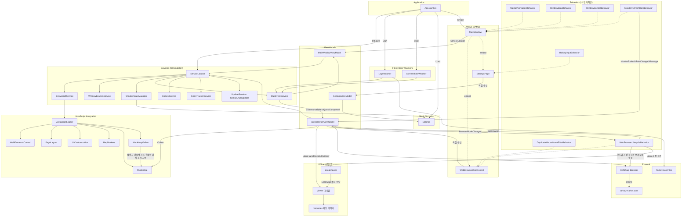
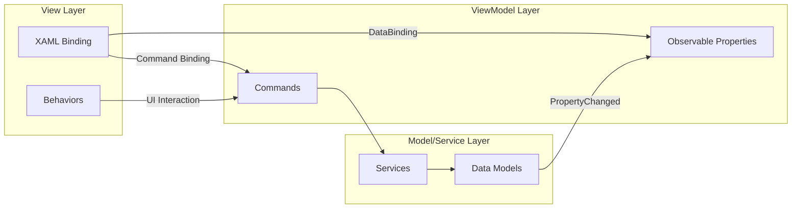
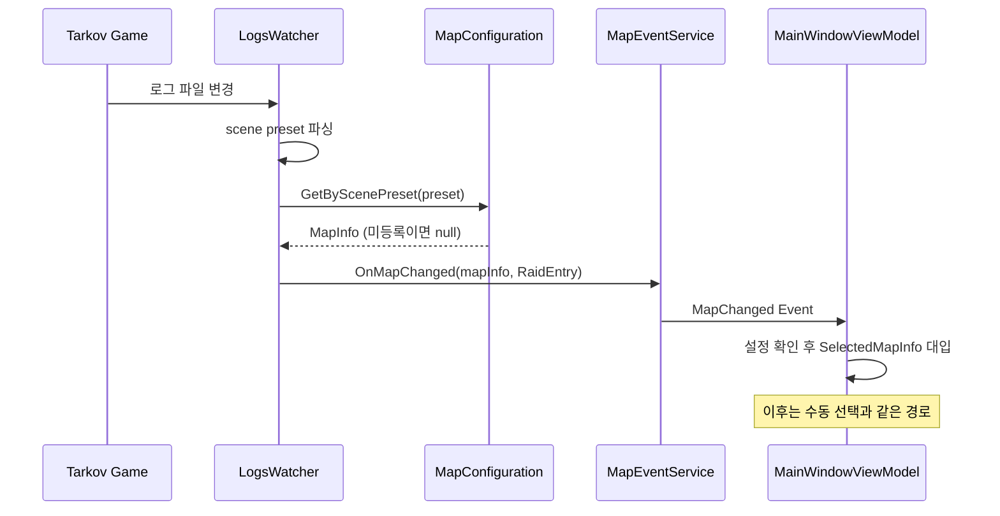
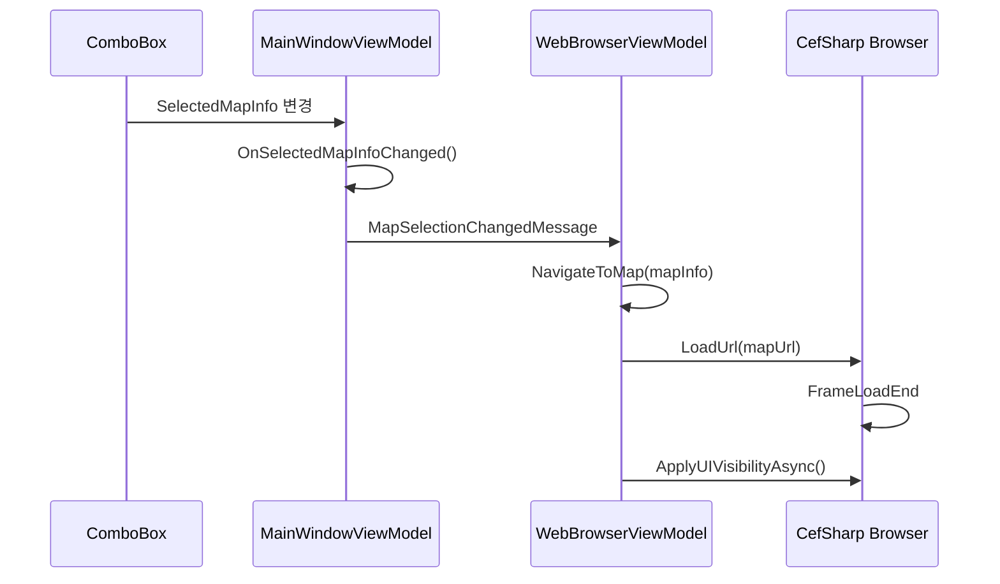
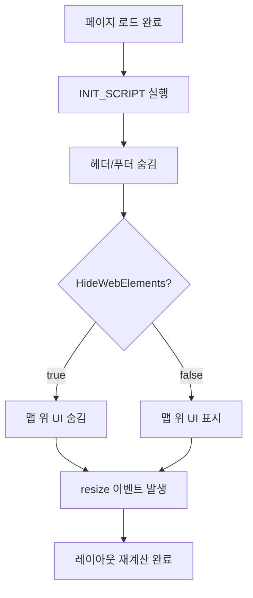
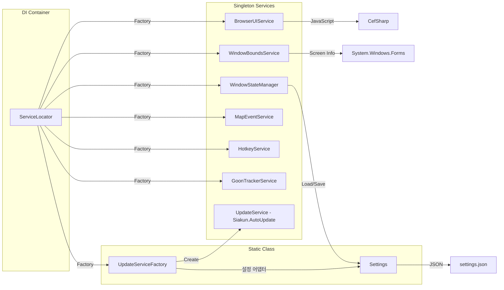
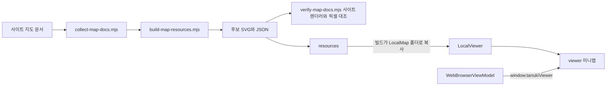
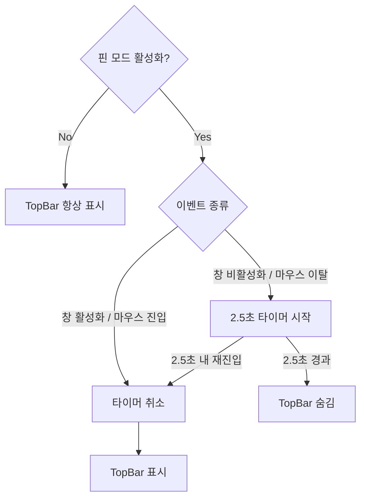
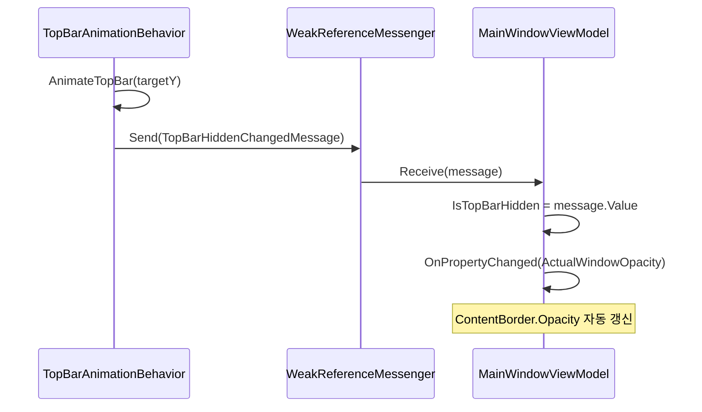

# TanukiTarkovMap 프로젝트 설계 문서

## 개요

Escape from Tarkov 게임을 위한 인터랙티브 맵 뷰어 애플리케이션입니다.
CefSharp를 통해 tarkov-market.com의 맵을 표시하며, 게임 로그 감시를 통한 자동 맵 전환 기능을 제공합니다.

이 앱의 코어는 **레이드 중인 사용자의 현재 위치와 바라보는 방향을 지도에 표시하는 것**입니다.
그다음이 지도와 탈출구이고(상단바의 `PMC`/`SCAV` 구분이 여기 속합니다), 퀘스트와 키를 비롯한
나머지는 부가 기능입니다. 로컬 모드는 사이트가 바뀌거나 죽어도 이 코어가 계속 돌게 하는 비상
경로이며, 사이트 코드 없이 앱에 담긴 지도 데이터를 자체 미니맵으로 그립니다. 우선순위와 그로부터
나오는 판단 기준은 [CLAUDE.md](CLAUDE.md)의 "이 프로젝트의 코어"에 있습니다.

---

## 아키텍처 다이어그램

### 전체 구조


```mermaid
graph TB
    subgraph Views["Views (XAML)"]
        MW[MainWindow]
        SP[SettingsPage]
        WBU[WebBrowserUserControl]
    end

    subgraph Behaviors["Behaviors (UI 인터랙션)"]
        TBA[TopBarAnimationBehavior]
        WDB[WindowDragBehavior]
        WCB[WindowControlBehavior]
        HIB[HotkeyInputBehavior]
        MRB[MonitorRefreshRateBehavior]
        DMF[DuplicateMouseMoveFilterBehavior]
        WBL[WebBrowserLifecycleBehavior]
    end

    subgraph ViewModels["ViewModels"]
        MWVM[MainWindowViewModel]
        SPVM[SettingsViewModel]
        WBVM[WebBrowserViewModel]
    end

    subgraph Services["Services (DI Singleton)"]
        SL[ServiceLocator]
        BUI[BrowserUIService]
        WBS[WindowBoundsService]
        WSM[WindowStateManager]
        MES[MapEventService]
        HKS[HotkeyService]
        GTS[GoonTrackerService]
        UPS[UpdateService - Siakun.AutoUpdate]
    end

    subgraph StaticServices["Static Services"]
        SET[Settings]
    end

    subgraph FileSystem["FileSystem Watchers"]
        LW[LogsWatcher]
        SW[ScreenshotsWatcher]
    end

    subgraph Offline["Offline (로컬 맵)"]
        LV[LocalViewer]
        VIEWER[viewer 미니맵]
        DATA[resources 지도 데이터]
    end

    subgraph Application["Application"]
        APP[App.xaml.cs]
    end

    subgraph JavaScript["JavaScript Integration"]
        JSL[JavaScriptLoader]
        WEC[WebElementsControl]
        PL[PageLayout]
        UIC[UICustomization]
        MM[MapMarkers]
        PB[PilotBridge]
        MKV[MapKeepVisible]
    end

    subgraph External["External"]
        CEF[CefSharp Browser]
        TM[tarkov-market.com]
        TK[Tarkov Log Files]
    end

    MW -->|ServiceLocator| MWVM
    SP -->|직접 생성| SPVM
    WBU -->|직접 생성| WBVM

    MW -.->|embed| WBU
    MW -.->|embed| SP

    TBA -.-> MW
    WDB -.-> MW
    WCB -.-> MW
    HIB -.-> SP
    MRB -.-> MW
    MRB -->|MonitorRefreshRateChangedMessage| WBVM
    DMF -.-> WBU
    WBL -.-> WBU
    WBL -->|SetBrowser| WBVM

    MWVM --> SL
    WBVM --> SL

    SL --> BUI
    SL --> WBS
    SL --> WSM
    SL --> MES
    SL --> HKS
    SL --> GTS
    SL --> UPS

    SPVM --> SET
    WSM --> SET

    APP -->|Initialize| SL
    APP -->|Start| LW
    APP -->|Start| SW
    APP -->|Load| SET
    APP -->|Create| MW

    LW --> MES
    SW --> MES
    MES --> MWVM
    MES -->|ScreenshotTaken/QuestCompleted| WBVM

    BUI --> JSL
    JSL --> WEC
    JSL --> PL
    JSL --> UIC
    JSL --> MM
    JSL --> PB
    JSL --> MKV
    MKV -.->|페이지 안에서 지도 객체와 위치 표시 사용| PB
    WBVM -->|Online| PB
    WBVM -->|Local: window.tanukiViewer| VIEWER

    WBVM -->|BrowserModeChanged| WBL
    WBL -->|모드별 저장 공간과 브라우저 생성| CEF
    WBL -->|Local 저장 공간| LV
    LV -->|LocalMap 폴더 응답| VIEWER
    VIEWER --> DATA
    WBVM --> CEF
    CEF -->|Online| TM
    LW --> TK
```

### MVVM 데이터 흐름


```mermaid
flowchart LR
    subgraph View["View Layer"]
        XAML[XAML Binding]
        BEH[Behaviors]
    end

    subgraph ViewModel["ViewModel Layer"]
        CMD[Commands]
        PROP[Observable Properties]
    end

    subgraph Model["Model/Service Layer"]
        SVC[Services]
        DATA[Data Models]
    end

    XAML -->|DataBinding| PROP
    XAML -->|Command Binding| CMD
    BEH -->|UI Interaction| CMD
    CMD --> SVC
    SVC --> DATA
    DATA -->|PropertyChanged| PROP
```

### 맵 전환 시퀀스

#### 자동 맵 전환 (Tarkov 로그 감지)


```mermaid
sequenceDiagram
    participant TK as Tarkov Game
    participant LW as LogsWatcher
    participant MC as MapConfiguration
    participant MES as MapEventService
    participant MWVM as MainWindowViewModel

    TK->>LW: 로그 파일 변경
    LW->>LW: scene preset 파싱
    LW->>MC: GetByScenePreset(preset)
    MC-->>LW: MapInfo (미등록이면 null)
    LW->>MES: OnMapChanged(mapInfo, RaidEntry)
    MES->>MWVM: MapChanged Event
    MWVM->>MWVM: 설정 확인 후 SelectedMapInfo 대입
    Note over MWVM: 이후는 수동 선택과 같은 경로
```

#### 수동 맵 선택 (UI 드롭다운)


```mermaid
sequenceDiagram
    participant UI as ComboBox
    participant MWVM as MainWindowViewModel
    participant WBVM as WebBrowserViewModel
    participant CEF as CefSharp Browser

    UI->>MWVM: SelectedMapInfo 변경
    MWVM->>MWVM: OnSelectedMapInfoChanged()
    MWVM->>WBVM: MapSelectionChangedMessage
    WBVM->>WBVM: NavigateToMap(mapInfo)
    WBVM->>CEF: LoadUrl(mapUrl)
    CEF->>CEF: FrameLoadEnd
    WBVM->>CEF: ApplyUIVisibilityAsync()
```

### UI 요소 숨기기 흐름


```mermaid
flowchart TD
    START[페이지 로드 완료] --> INIT[INIT_SCRIPT 실행]
    INIT --> ALWAYS[헤더/푸터 숨김]
    ALWAYS --> CHECK{HideWebElements?}
    CHECK -->|true| HIDE[맵 위 UI 숨김]
    CHECK -->|false| SHOW[맵 위 UI 표시]
    HIDE --> RESIZE[resize 이벤트 발생]
    SHOW --> RESIZE
    RESIZE --> END[레이아웃 재계산 완료]
```

### 서비스 의존성


```mermaid
graph LR
    subgraph DI["DI Container"]
        SL[ServiceLocator]
    end

    subgraph Services["Singleton Services"]
        BUI[BrowserUIService]
        WBS[WindowBoundsService]
        WSM[WindowStateManager]
        MES[MapEventService]
        HKS[HotkeyService]
        GTS[GoonTrackerService]
        UPS[UpdateService - Siakun.AutoUpdate]
    end

    subgraph Static["Static Class"]
        SET[Settings]
        USF[UpdateServiceFactory]
    end

    SL -->|Factory| BUI
    SL -->|Factory| WBS
    SL -->|Factory| WSM
    SL -->|Factory| MES
    SL -->|Factory| HKS
    SL -->|Factory| GTS
    SL -->|Factory| USF
    USF -->|Create| UPS
    USF -->|설정 어댑터| SET

    WSM -->|Load/Save| SET
    SET -->|JSON| FILE[settings.json]
    BUI -->|JavaScript| CEF[CefSharp]
    WBS -->|Screen Info| WIN[System.Windows.Forms]
```

---

## 기술 스택

| 항목 | 기술/라이브러리 |
|------|-----------------|
| UI Framework | WPF (Windows Presentation Foundation) |
| Target Framework | .NET 8.0 |
| 웹뷰 | CefSharp.Wpf.NETCore |
| DI/IoC | Microsoft.Extensions.DependencyInjection |
| MVVM | CommunityToolkit.Mvvm |
| JSON | Newtonsoft.Json |
| 시스템 트레이 | Hardcodet.NotifyIcon.Wpf |

---

## 핵심 속성 (MainWindowViewModel)

```csharp
// 모드 상태
bool IsAlwaysOnTop        // 핀 모드 (TopMost)
bool IsTopmost            // 실제 TopMost 상태 (바인딩용)

// 핫키 설정
bool HotkeyEnabled        // 핫키 활성화 여부
string HotkeyKey          // 핫키 키 (기본: F11)

// UI 설정
bool HideWebElements      // 웹 UI 요소 숨김 여부
bool IsPmcExtraction      // Extraction 필터 (true=PMC, false=SCAV)

// 창 투명도
double WindowOpacity      // 사용자 설정 투명도 (0.1 ~ 1.0)
bool IsTopBarHidden       // TopBar 숨김 상태
double ActualWindowOpacity // 실제 적용 투명도 (계산됨)
                          // TopBar 보임 → 1.0
                          // TopBar 숨김 → WindowOpacity
```

---

## 프로젝트 구조

```
resources/                  # Local 미니맵이 읽는 지도 데이터 (사이트 지도 문서를 변환한 SVG와 JSON)
tools/                      # 지도 데이터 수집과 변환, 검증 도구
viewer/                     # Local 모드의 미니맵 (생 JavaScript와 SVG, 빌드 단계 없음)
src/TanukiTarkovMap/
├── Models/
│   ├── Data/           # 데이터 모델 (MapInfo, Settings 등)
│   ├── FileSystem/     # 파일 시스템 감시 (LogsWatcher, ScreenshotsWatcher)
│   ├── JavaScript/     # CefSharp JavaScript 통합
│   ├── Offline/        # Local 미니맵의 주소와 파일 응답 (LocalViewer)
│   ├── Services/       # 비즈니스 로직 서비스
│   └── Utils/          # 유틸리티 (Logger, HotkeyManager 등)
├── ViewModels/         # MVVM ViewModel
├── Views/              # WPF XAML 뷰
├── Converters/         # WPF Value Converters
└── Resources/          # XAML 리소스 (스타일)
```

### 로컬 맵 뷰어

`viewer/`는 tarkov-market 사이트 번들을 실행하지 않고 `resources/`의 SVG와 JSON을 직접 읽습니다.
맵 목록은 `MapConfiguration.cs`가 정하고, 리소스 검사가 `resources/manifest.json`과 일치하는지
확인합니다. 지형과 추출구의 갱신은 리소스 교체로 끝나고, 새 맵만 앱의 맵 등록이 함께 필요합니다.
`resources/`에는 실행 코드를 두지 않습니다. SVG에 스크립트나 외부 참조가 있으면 검사가 거부합니다.


```mermaid
flowchart LR
    SITE[사이트 지도 문서] --> COLLECT[collect-map-docs.mjs]
    COLLECT --> BUILD[build-map-resources.mjs]
    BUILD --> CANDIDATE[후보 SVG와 JSON]
    CANDIDATE --> COMPARE[verify-map-docs.mjs 사이트 렌더러와 픽셀 대조]
    CANDIDATE --> RESOURCES[resources]
    RESOURCES -->|빌드가 LocalMap 폴더로 복사| LV[LocalViewer]
    LV --> VIEWER[viewer 미니맵]
    HOST[WebBrowserViewModel] -->|window.tanukiViewer| VIEWER
```

Local은 전용 메모리 저장 공간에서 `https://tanuki-map.local/viewer/index.html?map=<MapInfo.Name>`을
엽니다. `LocalViewer`가 그 저장 공간에 CefSharp의 `FolderSchemeHandlerFactory`를 등록해 이 주소를
실행 파일 옆 `LocalMap` 폴더로 응답합니다. 리소스를 읽지 못하면 미니맵이 오류를 표시하고 네트워크
응답이나 Online으로 대체하지 않습니다. 화면과 동작의 작업 기준은 [AGENTS.md](AGENTS.md)의 Local 미니맵
절, 리소스 계약과 설계 근거는 [로컬 맵 뷰어 설계](docs/20260821-local-viewer-design.md)에 있습니다.

```bash
node tools/resource-bundle.mjs check resources    # 리소스 계약
node tools/verify-viewer.mjs                      # 미니맵 동작, --root publish/LocalMap이면 배포 결과
```

---

## 서비스 아키텍처

### ServiceLocator 패턴

모든 서비스는 `ServiceLocator`를 통해 DI 컨테이너로 관리합니다.

```csharp
// 서비스 접근
ServiceLocator.BrowserUIService
ServiceLocator.WindowBoundsService
ServiceLocator.MapEventService
ServiceLocator.WindowStateManager
ServiceLocator.HotkeyService
ServiceLocator.GoonTrackerService
ServiceLocator.UpdateService
```

### 주요 서비스

| 서비스 | 역할 |
|--------|------|
| `BrowserUIService` | CefSharp UI 요소 가시성 제어 |
| `WindowBoundsService` | 창 경계 체크 및 화면 내 위치 보정 |
| `WindowStateManager` | 창 상태 저장/복원 |
| `MapEventService` | 맵 변경, 스크린샷, 퀘스트 완료 이벤트 발행 |
| `HotkeyService` | 전역 단축키 등록 및 토글 처리 (HotkeyManager 래핑) |
| `GoonTrackerService` | 활성화된 동안 PvE 군즈 최근 목격 제보 조회 |
| `UpdateService` | Siakun.AutoUpdate 패키지의 Velopack 업데이트 (백그라운드 자동 갱신, 설정에서 고른 버전 설치) |
| `UpdateServiceFactory` | 저장소 주소, 설정 저장, 준비 완료 메시지를 연결해 `UpdateService` 구성 |
| `Settings` | 애플리케이션 설정 로드/저장 (JSON) |

`UpdateService`는 [Siakun.AutoUpdate](https://github.com/siakun/Siakun.AutoUpdate) 패키지가 제공하며, 자동 갱신과 사용자가 고른 버전의 설치를 함께 다룹니다. 두 경로의 동작과 지원하는 배포 구조는 그 패키지의 README에 있고, 버전 선택을 이 방식으로 정한 이유는 [README의 버전 선택과 되돌리기](README.md#9-버전-선택과-되돌리기)에 적어 두었습니다. 앱은 `UpdateServiceFactory`에서 저장소 주소, 자동 업데이트 설정의 저장, 다운로드 완료 메시지를 연결합니다. Velopack은 이 패키지의 의존성으로 들어오므로 앱에서 버전을 따로 지정하지 않습니다.

Velopack의 시작 시 자동 적용과 `ApplyUpdatesAndRestart`는 쓰지 않습니다. 둘 다 앱의 정상 종료 경로를 우회할 수 있으므로, 다운로드한 패키지는 `App`이 CEF를 닫은 뒤 `UpdateService.ApplyOnExit()`으로만 적용합니다.

릴리스를 패키징하는 vpk는 `.config/dotnet-tools.json`에 고정해 CI와 `build.bat`이 같은 버전을 씁니다. 패키지에 들어가는 Update.exe도 vpk 버전을 따라 바뀌므로, 이 버전이나 패키지 버전을 바꾼 뒤에는 [업데이트 실제 설치 검증](docs/20260930-update-install-verification.md)을 거쳐 릴리스합니다. 검증 빌드는 `-p:UpdateRepositoryUrl`로 업데이트를 받을 저장소만 테스트 저장소로 바꿉니다.

업데이트 확인은 메인 창을 띄운 **뒤에** 시작합니다. 시작을 막지 않는 것이 이 앱에서는
다른 무엇보다 앞서기 때문이며, 그렇게 정한 근거와 뒤집을 조건은
[시작 속도와 업데이트 시점](docs/20260816-startup-speed-and-updates.md)에 적어 두었습니다.

full과 delta 중 무엇을 받을지, 배포 구조가 그 판단을 어떻게 제약하는지, 데이터
마이그레이션과 다운그레이드가 어떻게 얽히는지는 [업데이트 전달 설계](docs/20260816-update-delivery-design.md)에
정리해 두었습니다. 구현을 바꾸기 전에 그 문서의 결정 표와 전환 신호를 먼저 봅니다.

### 서비스 생성자 규칙

```csharp
// internal 생성자로 외부 new 방지
internal ServiceName() { }

// ServiceLocator에서 Factory 패턴으로 생성
services.AddSingleton(_ => new ServiceName());
```

---

## 이벤트 흐름

### 맵 자동 전환

```
타르코프 로그 파일 변경
       ↓
  LogsWatcher 감지 (scene preset 파싱)
       ↓
  MapConfiguration.GetByScenePreset() -> MapInfo
       ↓
  MapEventService.OnMapChanged(mapInfo, MapChangeSource.RaidEntry)
       ↓
  MainWindowViewModel.OnMapEventReceived()  [AutoMapSwitchEnabled 확인]
       ↓
  SelectedMapInfo 대입 -> MapSelectionChangedMessage
       ↓
  CefSharp URL 변경
```

### 맵 자동 전환 (스크린샷 보정)

레이드 도중 앱을 켜면 진입 로그가 이미 지나가 위 경로가 발동하지 않습니다.
레이드 안에서 찍은 스크린샷은 그 시점에 레이드 중이라는 증거이므로 이를 신호로 삼아 보정합니다.

메뉴와 은신처에서 찍은 스크린샷은 파일명에 좌표가 없습니다. 이것까지 신호로 쓰면
다음 레이드를 고르려고 지도를 손으로 바꿔 둔 사용자가 지난 판의 맵으로 되돌아가므로,
좌표가 있는 파일명만 보정에 씁니다.

```
스크린샷 파일 생성
       ↓
  ScreenshotsWatcher 감지 (파일명에 좌표가 없으면 여기서 중단)
       ↓
  LogsWatcher.LastDetectedMap (따라잡기 읽기 구간에서 기억해 둔 마지막 맵)
       ↓
  MapEventService.OnMapChanged(mapInfo, MapChangeSource.Screenshot)
       ↓
  MainWindowViewModel.OnMapEventReceived()  [ScreenshotMapSyncEnabled 확인]
       ↓
  이미 같은 맵이면 중단, 아니면 위와 같은 경로로 전환
```

두 경로는 신뢰도가 달라 설정에서 각각 끕니다. 진입 감지는 게임 로그에서 방금 읽은
사실이지만, 스크린샷 보정은 마지막으로 읽어 둔 맵을 다시 쓰는 추측입니다.

### 스크린샷 위치 표시와 퀘스트 완료 (Pilot 브리지)

스크린샷 파일명의 좌표와 회전값으로 위치와 방향을 표시합니다. Online은 앱의 브리지가 사이트의
위치 입력 경로와 지도별 좌표 변환을 이용하고, Local은 미니맵이 같은 식으로 직접 그립니다. 브리지는
사이트가 제공하는 함수와 상태가 실제로 있는지로 입력 경로를 고릅니다. 사이트가 프로그램용 입력을
모두 없앤 판에서는 "Where am i" 입력의 처리기를 씁니다.

```
스크린샷 파일 생성
       ↓
  ScreenshotsWatcher 감지 -> 필요한 맵 전환 먼저 요청
       ↓
  MapEventService.OnScreenshotTaken(filename)
       ↓
  WebBrowserViewModel이 대상 맵(MapInfo.Name)과 최신 입력 보관
       ↓
  MaintainPositionAsync -> Online: 방향 표시와 브리지 스크립트 확인과 복구
       ↓
  Online: window.tanukiPilot.sendScreenshot / Local: window.tanukiViewer.showScreenshot
       ↓
  지도에 위치 마커와 방향이 반영됐는지 확인 -> 성공하면 대기 해제
```

페이지 로드 완료, 스크린샷 수신과 주기 확인이 같은 경로를 사용합니다. 호출이 끝나도 지도 반영이
확인되지 않으면 최신 입력을 다시 보냅니다. 주기 확인은 반영 여부만 보고 화면을 옮기지 않으므로,
사용자가 지도를 옮겨 마커가 화면 밖에 있어도 재센터링하지 않습니다. 퀘스트 완료는 Online의
`SendToPilot()`이 같은 사이트 서비스로 전달하지만 위치 재시도에는 넣지 않습니다.

`WebBrowserLifecycleBehavior`는 모드 전환 때 브라우저를 교체합니다. Online은 기존 프로필을
사용하고 Local은 독립된 메모리 `RequestContext`로 열어 DB와 캐시를 분리합니다.
`WebBrowserViewModel`은 교체 중에도 현재 맵과 마지막 위치를 보관하며 이전 브라우저의 응답을
무시합니다. 저장 공간을 분리하는 이유와 전환 시 초기화되는 상태는
[오프라인 맵 설계](docs/20260818-offline-map.md)에 정리했습니다.

2026-08-17 Pilot v2 이전에는 포트 5123의 WebSocket 서버로 같은 사건을 넘겼으나, 사이트가
로컬 앱에 접속하지 않게 되어 이 경로로 옮겼습니다. 무엇이 깨졌고 어떤 대안을 버렸는지,
사이트가 또 바꿨을 때 어떻게 알아차리는지는 [Pilot 연동과 위치 전달 경로](docs/20260817-pilot-bridge.md)에
정리해 두었습니다. 이 경로를 고치기 전에 그 문서의 대안 비교와 전환 신호를 먼저 봅니다.

---

## 설정 파일 구조

`settings.json` 위치: `%APPDATA%\TanukiTarkovMap\settings.json`

사용자 폴더 경로는 모두 `AppPaths`가 정합니다. 설정과 브라우저 캐시는 생명주기가 반대라 서로 다른 폴더에 둡니다.

| 대상 | 폴더 | 이유 |
|------|------|------|
| 설정 | `%APPDATA%`(Roaming) | Velopack 설치 폴더 밖이라 앱을 제거해도 남고, 다시 설치하면 이어 씁니다 |
| 브라우저 캐시 | `%LOCALAPPDATA%\TanukiTarkovMap\Cache` | Velopack 설치 폴더 안이라 `Update.exe --uninstall`이 지울 때 함께 정리됩니다 |

0.1.0까지는 두 폴더가 반대였습니다. 예전 설정을 Local에서 Roaming으로 넘기는 규칙은 `SettingsLocationMigration`, 브라우저 프로필을 Roaming에서 Local로 넘기는 규칙은 `BrowserCacheLocationMigration`이 맡습니다. `AppPaths.PrepareOnStartup()`은 두 이전을 차례로 호출한 뒤 불어난 코드 캐시를 비웁니다. CEF가 캐시 폴더를 여는 순간 손댈 수 없으므로 `InitializeCef()`보다 먼저 호출해야 합니다.

브라우저 프로필 이전이 실패하면 그 실행의 `BrowserCacheFolder`는 예전 원본 경로를 가리킵니다. 실패 중 생긴 Local 대상은 지워 다음 시작에서 이전을 다시 시도하며, 빈 Local 폴더가 이전 완료 표시처럼 남지 않게 합니다.

### 브라우저 캐시 관리

캐시는 두 갈래로 쌓이고 성질이 달라 다르게 다룹니다. 실측한 값은 맵 하나를 처음 열 때 HTTP 캐시 21MB, 맵을 열 때마다 코드 캐시 0.8MB입니다.

| 갈래 | 쌓이는 방식 | 처리 |
|------|-------------|------|
| HTTP 캐시 (맵 타일) | 맵 종류만큼만 쌓여 스스로 포화 (11종 약 230MB) | 상한을 걸지 않습니다. 걸면 타일이 밀려나 매번 다시 받습니다 |
| 코드 캐시 (JS 바이트코드) | 맵을 열 때마다 늘어 상한이 없음 | `AppPaths.CodeCacheLimitMegabytes`를 넘으면 시작할 때 그 폴더만 비웁니다 |

사용자가 설정에서 캐시 전체를 비울 수도 있습니다. 실행 중에는 CEF가 프로필 파일을 붙들고 있어 지울 수 없으므로, 예약해 두었다가 `Cef.Shutdown()` 뒤에 지웁니다.

```json
{
  "NormalLeft": 100,
  "NormalTop": 100,
  "NormalWidth": 1000,
  "NormalHeight": 700,
  "HotkeyEnabled": true,
  "HotkeyKey": "F11",
  "IsAlwaysOnTop": false,
  "WindowOpacity": 1.0
}
```

---

## Online의 UI 요소 숨기기 로직

### 개념

tarkov-market.com 웹페이지의 UI 요소를 JavaScript로 제어해 맵만 표시합니다. Local 미니맵은 사이트
페이지가 아니므로 이 주입을 쓰지 않고, 같은 체크박스를 `window.tanukiViewer.setControlsVisible`로
받아 자기 조작 UI(Levels 패널과 Alt 휠 안내)만 숨깁니다.

### 요소 분류

| 요소 | 숨김 조건 | 복원 가능 |
|------|-----------| ----------|
| **헤더 (header)** | 항상 숨김 | X |
| **푸터 (footer-wrap)** | 항상 숨김 | X |
| **쿠키 안내 (cookie-consent)** | 항상 숨김 | X |
| **맵 레이어** (맵 컨테이너 `.map-cont`의 직계 자식 중 `MAP_LAYER_SELECTORS`에 든 것) | 숨기지 않음 | - |
| **그 밖의 맵 위 UI** (좌/우/상단 패널을 비롯한 `.map-cont`의 나머지 직계 자식) | 체크 시 | 가능 |

### 동작 방식

```
페이지 로드 완료
       ↓
INIT_SCRIPT 실행 (함수들을 window 객체에 등록)
       ↓
헤더/푸터 항상 숨김 (window.hideHeader(), window.hideFooter())
       ↓
"UI 요소 숨기기" 체크 여부 확인
       ↓
  ┌─ 체크됨: 맵 위 UI도 숨김 (window.hidePanelLeft() 등)
  └─ 해제됨: 맵 위 UI 복원 (window.restorePanels())
       ↓
resize 이벤트 발생 → SVG 맵 레이아웃 재계산
```

### 핵심 원칙

1. **헤더/푸터는 항상 숨김**: 맵 이동, 체크 해제와 무관하게 절대 표시하지 않음
2. **남길 것을 적는 화이트리스트**: "UI 요소 숨기기" 체크박스는 `.map-cont`의 직계 자식 가운데 맵
   레이어만 남기고 나머지를 모두 숨깁니다. 숨길 것을 나열하면 사이트가 맵 위에 UI를 얹을 때마다 목록을 고쳐야
   하지만, 맵 레이어는 그보다 드물게 바뀝니다. 대신 사이트가 맵 레이어를 새로 만들면 그 레이어가
   체크했을 때만 사라지므로, 그때는 `web-elements-control.js`의 `MAP_LAYER_SELECTORS`에 그 레이어를 추가합니다.
   현재 위치 마커(`.marker`)를 담은 레이어는 목록과 무관하게 남깁니다
3. **레이아웃 재계산**: 요소 숨김 후 `window.dispatchEvent(new Event('resize'))` 호출로 검은 영역 방지
4. **숨김은 스타일시트 규칙으로**: 요소의 `style.display`를 직접 넣지 않습니다. 인라인 방식은 나중에
   만들어진 요소를 놓치고, 다른 스크립트가 `style.cssText`를 대입하면 함께 지워집니다. 0.2.4에서
   `ui-customization.js`가 헤더의 `cssText`를 덮어써 상단 바가 되살아났습니다. `!important` 규칙은
   인라인 스타일보다 우선하므로 두 경우를 모두 막습니다

### JavaScript 스크립트 구조

온라인 주입용 JavaScript는 다음 패턴으로 관리됩니다. 자체 뷰어는 `viewer/`의 ES 모듈을 직접
제공하며 Embedded Resource로 주입하지 않습니다.

```
Models/JavaScript/
├── Scripts/                      # 실제 JavaScript 파일 (Embedded Resource)
│   ├── web-elements-control.js   # UI 요소 제어 함수 정의
│   ├── page-layout.js            # 마진/패딩 제거
│   ├── pilot-bridge.js           # 사이트의 위치 입력 경로로 스크린샷 전달
│   ├── map-keep-visible.js       # 맵을 창에 맞추고 지형이 화면 가운데를 벗어나지 않게 함
│   └── ...
├── WebElementsControl.js.cs      # C# 래퍼 (함수 호출용 상수)
├── PageLayout.js.cs              # C# 래퍼
├── PilotBridge.js.cs             # C# 래퍼
└── JavaScriptLoader.cs           # Embedded Resource 로더
```

**동작 원리:**
1. `.js` 파일: IIFE 패턴으로 함수들을 `window` 객체에 등록
2. `.js.cs` 파일: `JavaScriptLoader.Load()`로 스크립트 로드 + 함수 호출 상수 정의
3. `BrowserUIService`: 초기화 스크립트 -> 함수 호출 순서로 실행

페이지 후처리는 `FrameLoadEnd`에서 시작합니다. `page-health.js`는 사이트 초기화 중에 난 오류도
잡아야 하므로 `FrameLoadStart`에 넣습니다. 방향 표시와 Pilot 브리지는
페이지 로드뿐 아니라 주기 확인과 스크린샷 수신 때도 응답을 확인해 복구합니다. 상태 보고
스크립트가 보낸 오류와 맵 렌더 여부는 앱 로그에 `[PageHealth]`로 남습니다.

**예시 (WebElementsControl):**
```csharp
// 1. 함수 등록 (INIT_SCRIPT)
await browser.EvaluateScriptAsync(WebElementsControl.INIT_SCRIPT);

// 2. 함수 호출
await browser.EvaluateScriptAsync(WebElementsControl.HIDE_HEADER);  // "window.hideHeader();"
```

### 관련 파일

- `Scripts/web-elements-control.js`: JavaScript 함수 정의 (IIFE)
- `WebElementsControl.js.cs`: C# 래퍼 클래스 (INIT_SCRIPT, HIDE_* 상수)
- `BrowserUIService.cs`: 브라우저에 스크립트 실행 서비스
- `WebBrowserViewModel.cs`: 페이지 로드 시 `ApplyUIVisibilityAsync()` 호출
- `JavaScriptLoader.cs`: Embedded Resource에서 .js 파일 로드

주입 파이프라인, 페이지 조사 방법(CDP), 사이트를 고쳐 쓸 때 쓰는 기법과 함정은
[임베디드 웹페이지 제어 레퍼런스](docs/20260818-embedded-site-control.md)에 정리했습니다.

---

## TopBar 자동 숨김 동작

### 개요

핀 모드(IsAlwaysOnTop)를 켜면 TopBar가 자동으로 숨겨집니다.
마우스가 창을 떠나거나 창이 비활성화되면 2.5초 뒤에 숨깁니다.

### 동작 흐름


```mermaid
flowchart TD
    START{핀 모드 활성화?} -->|No| SHOW[TopBar 항상 표시]
    START -->|Yes| CHECK{이벤트 종류}
    CHECK -->|창 활성화 / 마우스 진입| CANCEL[타이머 취소]
    CANCEL --> VISIBLE[TopBar 표시]
    CHECK -->|창 비활성화 / 마우스 이탈| TIMER[2.5초 타이머 시작]
    TIMER -->|2.5초 내 재진입| CANCEL
    TIMER -->|2.5초 경과| HIDE[TopBar 숨김]
```

### 트리거 조건

| 이벤트 | 동작 |
|--------|------|
| 창 활성화 (Activated) | 타이머 취소, TopBar 표시 |
| 창 비활성화 (Deactivated) | 2.5초 타이머 시작 |
| 마우스 진입 (MouseEnter) | 타이머 취소, TopBar 표시 |
| 마우스 이탈 (MouseLeave) | 2.5초 타이머 시작 |

### 투명도 연동

TopBar 상태에 따라 창 투명도를 자동으로 조절합니다.

```
TopBar 표시 → ActualWindowOpacity = 1.0 (불투명)
TopBar 숨김 → ActualWindowOpacity = WindowOpacity (사용자 설정값)
```

### 메시지 흐름


```mermaid
sequenceDiagram
    participant TBA as TopBarAnimationBehavior
    participant MSG as WeakReferenceMessenger
    participant MWVM as MainWindowViewModel

    TBA->>TBA: AnimateTopBar(targetY)
    TBA->>MSG: Send(TopBarHiddenChangedMessage)
    MSG->>MWVM: Receive(message)
    MWVM->>MWVM: IsTopBarHidden = message.Value
    MWVM->>MWVM: OnPropertyChanged(ActualWindowOpacity)
    Note over MWVM: ContentBorder.Opacity 자동 갱신
```

### 관련 파일

- `Behaviors/TopBarAnimationBehavior.cs`: TopBar 애니메이션 및 타이머 로직
- `Messages/ViewModelMessages.cs`: TopBarHiddenChangedMessage 정의
- `ViewModels/MainWindowViewModel.cs`: IsTopBarHidden, ActualWindowOpacity 속성

---

## 위치 연동 검증

Online 위치 전달과 복구는 `tools/verify-map-recovery.mjs`, Online 맞춤과 이동 제한은
`tools/verify-map-keep-visible.mjs`가 작은 재현 페이지로 검사합니다. Local은 `tools/verify-viewer.mjs`가
미니맵과 리소스를 함께 열어 위치, 방향, 카메라, 오버레이 UI를 맵마다 검사하고, 리소스 계약은
`tools/resource-bundle.mjs check`가 봅니다. PR과 릴리스가 실행하는 범위는
`.github/workflows/verify-map-recovery.yml`이 기준입니다.

재현 페이지의 통과는 지금 온라인 사이트에서 동작한다는 뜻이 아닙니다. 사이트는 배포로 입력 경로와
지도 구조를 바꾸므로, 사이트 쪽 변화가 의심되면 `tools/verify-online.mjs`로 실제 사이트에 앱과 같은
스크립트를 넣어 확인합니다. 네트워크와 사이트의 봇 확인에 좌우되어 CI에는 넣지 않습니다. 어느 검사도
WPF 창을 실행하지 않으므로 CEF 컨트롤 교체와 게임 포커스 유지는 별도 실행 검증이 필요합니다.

## 용어 정리

| 용어 | 설명 |
|------|------|
| **핀 모드** | TopMost 설정 (항상 위에 표시) |
| **UI 요소 숨김** | 맵 컨테이너에서 맵 레이어만 남기고 나머지 UI를 스타일시트로 숨김 (헤더/푸터는 별도로 항상 숨김) |
| **TopBar 자동 숨김** | 핀 모드에서 2.5초 지연 후 상단 바 자동 숨김 |
| **Pilot 브리지** | 사이트에 있는 위치 입력 경로(Pilot 함수나 "Where am i" 처리기)로 위치를 전달하고 퀘스트 완료를 넘기는 어댑터 |
| **지도 맞춤** | 맵을 열 때 지형을 창에 맞추고, 끌거나 확대해도 지형이 화면 가운데를 벗어나지 않게 하는 규칙 (Online은 map-keep-visible.js, Local은 camera.js) |
| **로컬 모드** | 독립된 브라우저 저장 공간에서 앱에 담긴 지도 데이터를 자체 미니맵으로 여는 상태 (실험적 기능) |
