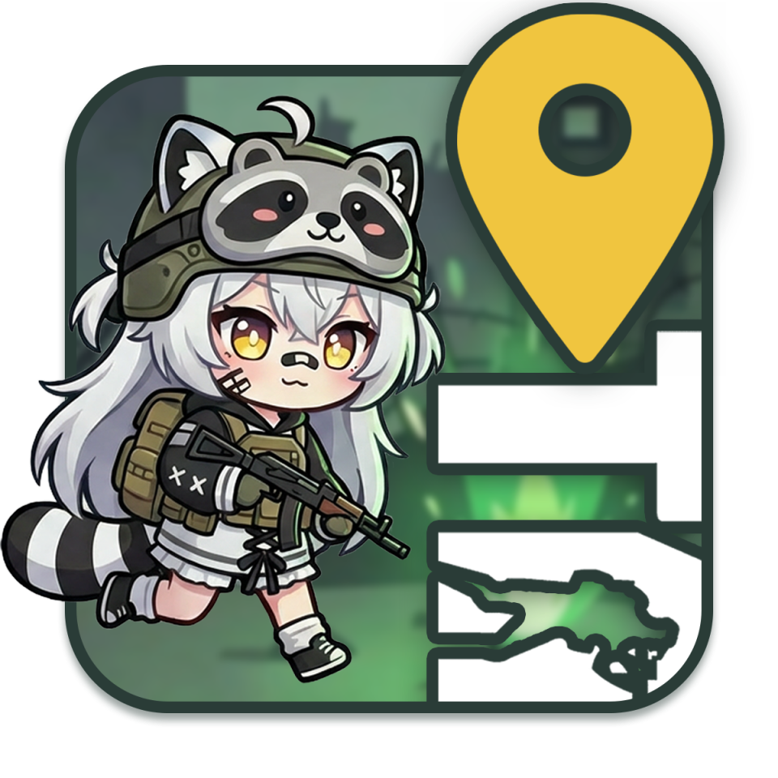
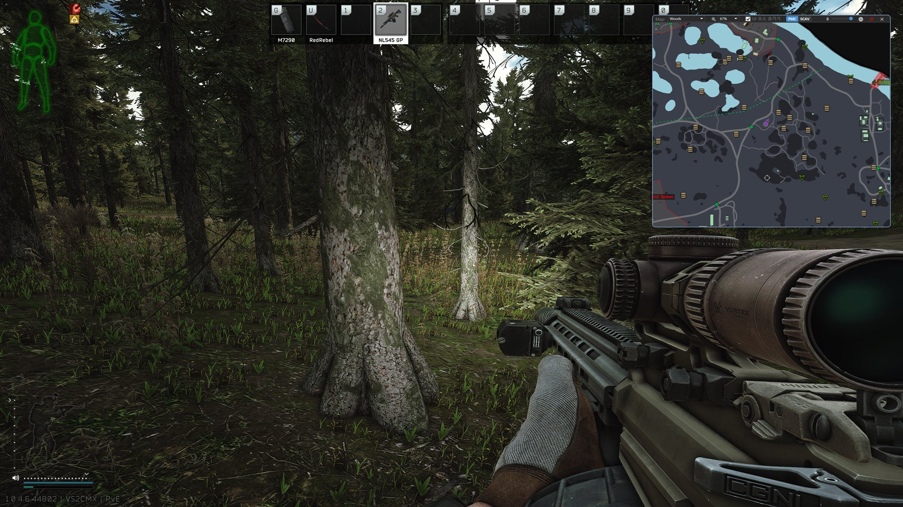

<!--
INTENT
README.md의 영어 번역이다. 원본은 README.md이며, README.md를 수정하면 같은 커밋에서 이 파일도 갱신한다.
설정 항목과 버튼 이름은 앱의 영어 화면 문구(src/TanukiTarkovMap/Localization/Strings.resx)와 같게 적어,
읽는 사람이 앱에서 같은 이름을 찾을 수 있게 한다. 한국어로만 있는 문서로 가는 링크에는 (in Korean)을 붙인다.
README.md 안의 INTENT 주석은 원본을 관리하는 메모라 옮기지 않는다.
-->
# TanukiTarkovMap

[한국어](README.md) | **English** | [日本語](README.ja.md)

<div align="center">

</div>

> **An in-game minimap overlay tool for Escape from Tarkov.<br>Take a screenshot, and it detects your coordinates and shows your current position on the minimap.**

TanukiTarkovMap opens the interactive map from [tarkov-market.com](https://tarkov-market.com/pilot) in a window that always stays on top of the game, and shows your current position in real time using the coordinates recorded in your in-game screenshots. You can check the map with a single hotkey, without Alt+Tab.



---

## Installation

1. Download the latest Setup installer (`TanukiTarkovMap-Setup-<version>-x64.exe`) from the [Releases page](https://github.com/siakun/TanukiTarkovMap/releases/latest).
2. Run it to install. Updates are applied automatically from then on. You can also turn off automatic updates or roll back to the version you want in Settings.

If you would rather not install it, download the portable version (`TanukiTarkovMap-Portable-<version>-x64.zip`) from the same page, extract it, and run it. The portable version has no installer, so you need to install the VC++ Redistributable listed in the requirements below yourself.

> **Requirements**: Windows 10/11 (x64), [Microsoft Visual C++ 2015-2022 Redistributable (x64)](https://aka.ms/vs/17/release/vc_redist.x64.exe)
>
> The Redistributable is the runtime used by the built-in browser (CefSharp). If it is missing, the Setup installer installs it for you during setup, so there is nothing to prepare; only the portable version needs it installed manually. Without it, the app fails to start with an error saying that `CefSharp.Core.Runtime.dll` could not be loaded.
>
> **Safety**: The app does not read game memory or interfere with the game process. It reads only two things: screenshot file names (only the coordinates in the name, not the image content) and the game logs that record which map you entered. It never modifies game files. See [Background](#background) for how it works.

---

## Usage

1. Launch TanukiTarkovMap. The game's screenshot folder is detected automatically, and you can set it yourself in Settings if needed.
2. When you start the game, the app switches to the map you entered automatically.
3. During the game, show or hide the map window with the hotkey (`F11` by default, configurable in Settings).
4. Press the in-game screenshot key (`PrtScn` by default) to show your current position on the map. Your position updates every time you take a screenshot.

The show/hide hotkey hides the whole minimap window to the tray or shows it again; it does not close the app. To update your position, use the game's Screenshot key. To keep the map above the game on a single monitor, turn on the pin (always on top) in the top bar.

> **Note for Steam users**: Steam's `F12` screenshot is a Steam overlay feature, so it does not record coordinates. Always use the Screenshot key from the game's own settings (Controls). Some players report that the default `PrtScn` does not work; if that happens, rebind it to another key.

In Settings, you can change the hotkey, opacity, UI visibility, automatic map switching, automatic screenshot cleanup, and how updates are applied. The same window also lets you check how much space the browser cache takes up as map tiles pile up, and clear it. If you run into a problem or have a suggestion, please post it on [GitHub Issues](https://github.com/siakun/TanukiTarkovMap/issues).

---

## Features

| Feature | Description |
|---------|-------------|
| Map overlay | Interactive map that always stays on top of the game (Always-on-Top) |
| Real-time position tracking | Shows your current position on the map automatically when you take an in-game screenshot |
| Automatic map switching | Detects the map you entered from the game log and switches to it |
| Global hotkey toggle | Shows or hides the map window with one hotkey (`F11` by default); supports modifier and special keys |
| Opacity control | Makes the window semi-transparent while the top bar is hidden, so it blocks as little of your view as possible |
| UI cleanup | Removes unnecessary elements from the web page so only the map is shown |
| Recent Goons sightings | Shows PvE sighting reports on the map |
| Update management | Applies new versions automatically, and lets you turn off automatic updates or roll back to an earlier version |
| Display language | Follows the Windows display language by default; picking a language in Settings switches it immediately without a restart |

Recent Goons sightings are off by default and can be turned on in Settings. The Goons spawn by chance, so reports may differ from where they actually appear.

---

## Background

In Escape from Tarkov, taking an in-game screenshot records the player's world coordinates (X, Y, Z) and camera rotation in the file name. This is an official feature that the developer, Battlestate Games, provides for bug reports, and the app only reads files saved on disk without accessing game memory or the game process.

```
2025-12-20[02-09]-420.18, 1.00, 319.01-0.00089, -0.99307, -0.00012, -0.11748_15.11 (0).png
└ date/time ┘ └ position X, Y, Z ┘ └ camera rotation (quaternion) ┘
```

The Pilot page on [tarkov-market.com](https://tarkov-market.com/pilot) takes these coordinates and shows your current position on the map. A web app opened in a browser, however, has structural limits. It cannot directly control operating system windows: it cannot pin itself on top of the game (Always-on-Top), make its window semi-transparent, or toggle with a global hotkey. That is why a desktop client is needed.

Several tools like this already exist. The original is [ggdiam/TarkovPilot](https://github.com/ggdiam/TarkovPilot) (.NET Framework, a tray-only helper), which tarkov-market.com officially detects, and [byeong1/Tarkov-Client](https://github.com/byeong1/Tarkov-Client) from the Korean community wrapped it in Edge WebView2 to show the map inside a window. This project started from the idea behind byeong1's version, but replaced the web view engine with CefSharp and redesigned window control, coordinate sync, and the build pipeline from scratch.

---

## Tech Stack

| Area | Technology |
|------|------------|
| Language, runtime | C#, .NET 8.0 |
| UI | WPF, MVVM (CommunityToolkit.Mvvm), Microsoft.Xaml.Behaviors |
| Web view | CefSharp.Wpf.NETCore (Chromium) |
| Native control | P/Invoke (user32.dll) |
| Web integration | CefSharp JavaScript injection (Pilot bridge) |
| Local map | SVG and ES module minimap, CefSharp folder scheme handler |
| DI | Microsoft.Extensions.DependencyInjection |
| Tray | Hardcodet.NotifyIcon.Wpf |
| Distribution, automatic updates | Velopack, Siakun.AutoUpdate, GitHub Actions |

---

## Technical Implementation

The core of this project is "a native client doing what a web app cannot." This section explains which problem each feature solves and how.

### 1. Porting from Edge WebView2 to CefSharp

The tool this project started from used Edge WebView2, which is built into Windows, but this project replaced the web view engine with CefSharp (Chromium Embedded Framework). WebView2's runtime depends on the user's environment, whereas CefSharp ships Chromium with the app, so it does not depend on the environment and gives more direct control over the render process, script injection, zoom, and similar behavior. The app injects customization scripts when a page finishes loading (`FrameLoadEnd`) and receives messages from the web page through `JavascriptMessageReceived`.

### 2. Native window control with P/Invoke (user32.dll)

Window control at the OS level, which a web app cannot do, is implemented directly with P/Invoke.

- **Always-on-Top**: Applies `HWND_TOPMOST` with `SetWindowPos` to keep the window above the game
- **Semi-transparent window**: Turns on the `WS_EX_LAYERED` style with `GetWindowLong`/`SetWindowLong` and sets the alpha value with `SetLayeredWindowAttributes(LWA_ALPHA)`
- **Global hotkey**: A low-level keyboard hook (`SetWindowsHookEx`) handles the toggle even while the game has focus

All Win32 calls are declared in one place, `PInvoke.cs`, and wrapped in intent-level wrappers such as `WindowTopmost` and `WindowTransparency`, so callers never handle the flags directly.

### 3. Real-time coordinate sync (FileSystemWatcher + Pilot bridge)

The app watches the screenshot folder in real time with `FileSystemWatcher`, and when a new file appears, it passes the file name to the Pilot bridge in the built-in browser. The bridge reads the coordinates and rotation from the file name and shows the position through the site's map features. The app also watches the game log (`LogsWatcher`) and switches to the map the player entered.

`PilotBridge` finds the position input path that actually exists on the page and passes the coordinates to it. It supports the old `window.pilot` path, Nuxt's Pilot service, and, after both disappeared, the "Where am i" input handler, and it completes delivery only after confirming that the coordinates are reflected on the map. It resends the latest input missed while the page was loading, and restores the direction script that is lost on a reload or page navigation.

Until 2026-08-17, the app ran a WebSocket server with ASP.NET Core Kestrel on port `5123`, and the site connected to that server to receive file names. That day, tarkov-market deployed Pilot v2, and the site switched to connecting only to its own server (`wss://tarkov-market.com/ws/pilot`) instead of the local app, so the server no longer had any clients. Following the server relay protocol would have meant implementing account authentication as well, while `window.pilot` did the same job without it, so the app dropped the WebSocket server and the ASP.NET Core dependency and switched to bridge calls. The diagnosis, rejected alternatives, and how to notice site changes are documented in [Pilot integration and position delivery paths](docs/20260817-pilot-bridge.md) (in Korean).

On 2026-10-07, the site removed both the position function of `window.pilot` and the position input of the Pilot service. Only the "Where am i" input, where users paste a screenshot file name, remained, so the bridge now finds that input's handler in the Vue components being rendered on screen and passes the same file name to it. This relies on the fact that function names in the minified bundle change with every deployment, but prop names in templates remain.

### 4. Offline map (experimental)

Turning on "Use local map" in Settings adds an Online/Local switch to the top bar. Local opens the map from map data bundled with the app, without connecting to the site. It keeps only the map and its levels, the extracts of the selected faction, and your current position and direction, so what you need in a raid keeps working even if the site is down or changes its position input.

At first, the app saved a full copy of the responses the site sent and served it back by intercepting requests. It worked, but the copy was a lump of minified bundles whose contents could not be read, and when the site changed its structure, the only option was to download everything again. Now the app collects only the site's map documents and converts them to SVG and JSON (`resources/`), and the minimap bundled with the app (`viewer/`) draws them to look like the site's map screen. The converted SVG is compared pixel by pixel, level by level, with what the collected site renderer draws, and the coordinate conversion is verified against the values the site computed.

Local opens in a separate temporary storage space so that it does not mix with the online DB and cache. When you switch modes, the app reopens the same map, passes the last position, and reapplies the app's faction, zoom, and "Hide UI elements" settings. The design rationale and limitations are documented in [Local map viewer design](docs/20260821-local-viewer-design.md) (in Korean).

### 5. Automatic map switching by parsing game logs

Each time the game starts, it creates a new session folder under its log folder (`<game folder>\Logs` for the official launcher, `<game folder>\build\Logs` for the Steam version) and records its state in files such as `application.log`. The game folder is detected automatically from the registry (official launcher first, then Steam), and if detection fails, you can set it yourself in Settings.

- **Official launcher**: The `InstallLocation` value of `HKLM\SOFTWARE\WOW6432Node\Microsoft\Windows\CurrentVersion\Uninstall\EscapeFromTarkov` (used only if the folder actually exists)
- **Steam**: Parses `steamapps\libraryfolders.vdf` under the `InstallPath` of `HKLM\SOFTWARE\WOW6432Node\Valve\Steam`, then checks `steamapps\common\Escape from Tarkov` in every library folder it finds

`LogsWatcher` watches the most recent session folder (moving to a new folder automatically when one appears), and whenever a log file is updated, it reads only the newly added lines from where it last stopped (it opens files with `FileShare.ReadWrite`, so it does not conflict with the game's writes). Logs that had already accumulated before the app started never switch the view, which prevents switching to the map of a previous raid by mistake.

The map is identified from the scene load log line (`scene preset`) by extracting the preset name from `path:maps/<preset>.bundle`. The `Location:` value in the match creation log (`TRACE-NetworkGameCreate profileStatus`) carries the same information, but the scene load line always comes first, and in some raids it is the only one recorded, so only the scene load line is used.

The extracted preset name is resolved to a map right where it is detected. This keeps the code that interprets log strings in one place, `LogsWatcher`, and later stages exchange only map objects, not strings.

```
scene preset line detected
  -> LogsWatcher          extract the preset name
  -> MapConfiguration     resolve the preset to a map (stops here for unregistered values)
  -> MapEventService      publish a map change event
  -> MainWindowViewModel  assign SelectedMapInfo (where manual selection from the dropdown joins)
  -> WebBrowserViewModel  navigate CefSharp to the new address
```

Maps and presets have a 1:N relationship. Ground Zero has a separate preset for each player level range, and Factory for each time of day, so each map is registered in `MapConfiguration` with a list of presets. When a preset that is not in any list appears, the app does not switch and only writes that name to the app log. That line tells you what to register when a new map is added to the game.

Routing automatic switching through `SelectedMapInfo` is also intentional. Joining at the same point as when the user picks a map from the dropdown leaves only one copy of the code that changes the address and reinjects the scripts. Turning off automatic switching skips only this assignment, so manual selection keeps working.

If you launch the app after entering a raid, the entry log has already gone by, so real-time detection cannot catch it. So the app still reads map names from past logs and remembers the last one, then uses a screenshot, which can only be taken in game, as the signal to correct to that map. If you are already viewing that map, nothing happens, so once the map has switched correctly, taking screenshots does not make the view jump.

In addition, the BattlEye initialization log (`BEClient inited successfully`) serves as a raid boundary signal that triggers automatic screenshot cleanup, and quest notifications (JSON) in the notification log are parsed to pass quest progress to the page.

### 6. Two-way communication between CefSharp and JavaScript

After the position and direction integration is changed, the same failure conditions are checked again by automated tests, whether or not the site is reachable. The tests run in a windowless Chromium on reproduction pages that imitate the site, and they also run for PRs and releases, where a failure stops the deployment. Compatibility with the current site is checked separately with a diagnostic tool that injects the same scripts as the app into the real site. The list of tests and how to run them are in [TESTING.md](TESTING.md) (in Korean).

The logic that adapts the web UI to the app is injected as JavaScript. The `.js` files are bundled as Embedded Resources, read by `JavaScriptLoader`, and run with `EvaluateScriptAsync` after the page loads (removing the header and footer, toggling panels, adding a direction indicator to the position marker, and so on). In the other direction, events on the web side (map changes, connection status) are sent with `postMessage`, received in `JavascriptMessageReceived`, and delivered to ViewModels through CommunityToolkit.Mvvm's `WeakReferenceMessenger`. Messages keep the boundary between C# and JS loosely coupled. Nothing is injected into the Local minimap; the app only calls the functions the minimap exposes on `window.tanukiViewer`. Techniques for adapting someone else's site inside an app, and the pitfalls encountered along the way, are documented in [Embedded web page control reference](docs/20260818-embedded-site-control.md) (in Korean).

### 7. MVVM architecture and DI

The project follows the rule of keeping no logic in code-behind (`*.xaml.cs`). UI interactions are separated into Behaviors based on Microsoft.Xaml.Behaviors (window dragging, minimizing to the tray, capturing hotkey input, and so on), and data and business logic live in ViewModels and Services. Services are registered with Microsoft.Extensions.DependencyInjection and accessed through `ServiceLocator`, and ViewModels communicate through the Messenger instead of direct references to reduce coupling.

### 8. Release automation (GitHub Actions + Velopack)

When a version tag (in the form `v1.0.0` or `0.1.0`) is pushed, GitHub Actions publishes a self-contained build, packages the installer and portable zip with Velopack (`vpk`), and uploads them to a GitHub Release automatically. On the user's side, Velopack's `UpdateManager` checks for a new version when the app starts, downloads it quietly, and applies it on the next launch. A single tag carries everything from build to distribution and automatic updates.

To bump the version, change `Version` in `src/TanukiTarkovMap/TanukiTarkovMap.csproj` and write the release notes in `docs/releases/<Version>.md`, following the guidelines of the [release-notes skill](.agents/skills/release-notes/SKILL.md) (in Korean). The per-version files in that directory are the update history, and at release time the same file goes into both the GitHub release body and the Velopack package. The release stops if the tag and the project version differ or if the notes file is missing. For local packaging, pass the same value as the project version to `build.bat <Version>`.

### 9. Choosing a version and rolling back

Automatic updates only move toward the latest version. That leaves a user who runs into a problem in a new version with no way out on their own, so Settings lets you turn off automatic updates and choose the version you want.

Velopack's default path cannot do this. `GithubSource` assumes that "all packages are gathered in the single latest release," so it reads only that release's `releases.win.json` and looks for download URLs only there. In this repository, a full package exceeds 250 MB, so each tag uploads only its own version, and the default path shows only two versions: the latest and the one before it. So the app queries the release list directly with the GitHub Releases API, creates an `IUpdateSource` (`GitHubReleaseSource`) pinned to the chosen tag, and runs it through Velopack's download, checksum verification, and apply steps. This update code is split out into the [Siakun.AutoUpdate](https://github.com/siakun/Siakun.AutoUpdate) package so that other apps can use it.

This is also why the app parses the feed JSON the release already contains instead of assembling package metadata itself. Velopack checks the SHA of a downloaded package against the value in the feed, and hand-built metadata has no such hash, so there would be no way to pass the check.

When moving up, the app downloads the deltas of the versions in between and applies them in sequence. A full package is 242 MB, while each delta is a few hundred KB, so the difference is large. Rolling back always downloads the full package, because deltas are only created in the upward direction. The full package is also downloaded when an intermediate release has been deleted, when there are too many steps to skip, or when the deltas add up to a size that is large compared with the full package. Since this can take a while, progress is shown on screen. Even after the download finishes, the app does not kill its process; it shuts down normally so that CefSharp releases its cookie and IndexedDB files, and then applies the package.

Choosing a version other than the latest also turns off automatic updates. If they stayed on, the next launch would immediately go back to the latest version, and the version the user chose would be lost.

Turning on "Get beta versions" under "Experimental features" in Settings adds pre-release versions such as `v0.1.1-beta` to the list and to automatic updates. While it is off, they are excluded at the query stage, so what you see in the list and what automatic updates follow are always the same.

This blocking works only from the version that introduced the automatic update setting. If you go down to an older version, that version's update code ignores the setting and fetches the latest, so you cannot stay there. Code that has already been released cannot be changed, so this cannot be prevented by design; instead, the Settings screen warns about it in advance.

---

## Development

After installing the .NET 8 SDK, you can build by running `dotnet build` in the `src` folder. Resource checks and packaging with `build.bat` require Node 22 or later. For architecture, design, and other development topics, see [`PROJECT.md`](PROJECT.md) (in Korean); for how to run the tests, see [`TESTING.md`](TESTING.md) (in Korean).

---

## License

[MIT License](LICENSE)

> This project is an unofficial tool and is not affiliated with Battlestate Games or Tarkov Market. It does not read game memory or interfere with the game process; it reads only screenshot file names (without reading the image content) and the game logs that record map names.
