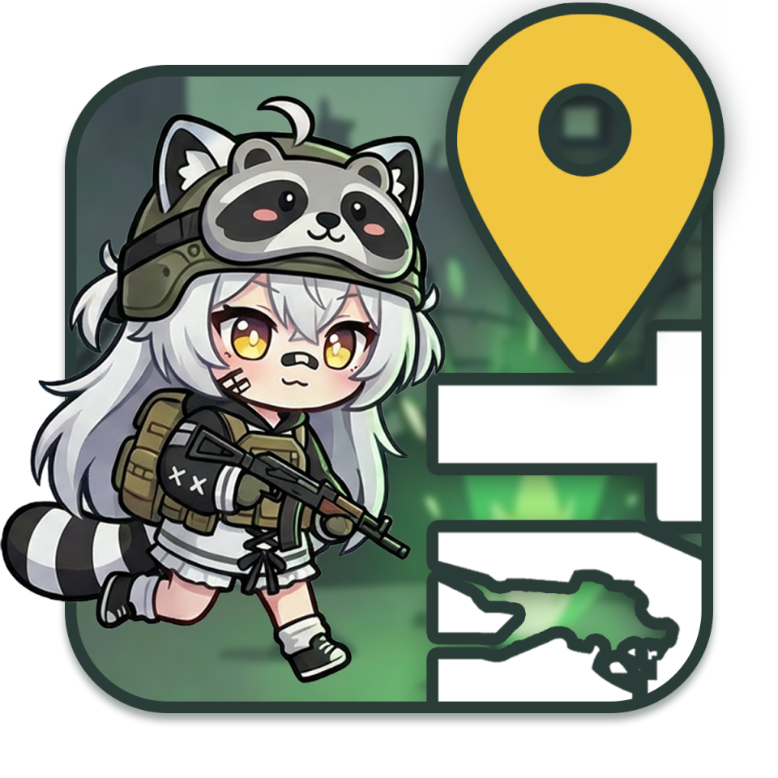
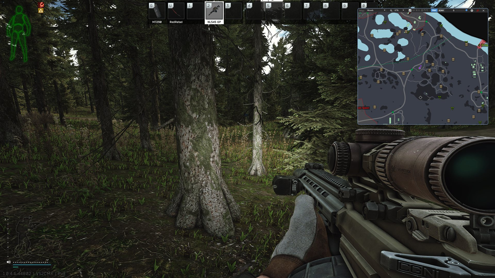

# TanukiTarkovMap

<div align="center">

</div>

> **Escape from Tarkov용 인게임 미니맵 오버레이 툴입니다.<br>스크린샷을 찍으면 좌표를 감지해 현재 위치를 미니맵에 표시합니다.**

게임 위에 항상 떠 있는 창으로 [tarkov-market.com](https://tarkov-market.com/pilot)의 인터랙티브 맵을 띄우고, 인게임 스크린샷에 기록된 좌표로 현재 위치를 실시간 표시합니다. 알트탭 없이 단축키 한 번으로 맵을 확인할 수 있습니다.



---

## 설치

1. [Releases 페이지](https://github.com/siakun/TanukiTarkovMap/releases/latest)에서 최신 Setup 설치 파일(`TanukiTarkovMap-Setup-<버전>-x64.exe`)을 내려받습니다.
2. 실행해 설치하면 이후 업데이트는 자동으로 적용됩니다. 설정에서 자동 업데이트를 끄거나 원하는 버전으로 되돌릴 수도 있습니다.

설치 없이 쓰고 싶다면 같은 페이지의 포터블 버전(`TanukiTarkovMap-Portable-<버전>-x64.zip`)을 내려받아 압축을 풀고 실행합니다.

> **요구 사항**: Windows 10/11 (x64)
>
> **안전성**: 게임 메모리를 읽거나 게임 프로세스에 개입하지 않습니다. 이 앱이 읽는 것은 스크린샷 파일명(이미지 내용이 아니라 이름에 담긴 좌표만)과 입장한 맵이 기록된 게임 로그 두 가지뿐이며, 게임 파일을 수정하지 않습니다. 자세한 원리는 [프로젝트 배경](#프로젝트-배경)을 참고하세요.

---

## 사용법

1. TanukiTarkovMap을 실행합니다. 게임의 스크린샷 폴더는 자동으로 감지되며, 필요하면 설정 창에서 직접 지정할 수 있습니다.
2. 게임을 시작하면 입장한 맵으로 자동 전환됩니다.
3. 게임 중 단축키(기본 `F11`, 설정에서 변경 가능)로 맵 창을 켜고 끕니다.
4. 인게임 스크린샷 키(기본 `PrtScn`)를 누르면 맵에 현재 위치가 표시됩니다. 스크린샷을 찍을 때마다 위치가 갱신됩니다.

> **Steam 사용자 주의**: Steam의 `F12` 스크린샷은 Steam 오버레이 기능이라 좌표가 기록되지 않습니다. 반드시 게임 자체 설정(Controls)의 Screenshot 키를 써야 하며, 기본 `PrtScn`이 동작하지 않는다는 보고가 있으니 그 경우 다른 키로 재바인딩하세요.

설정 창에서 단축키, 투명도, UI 표시 여부, 자동 맵 전환, 스크린샷 자동 정리, 업데이트 방식을 바꿀 수 있습니다. 맵 타일이 쌓이는 브라우저 캐시가 얼마나 되는지 확인하고 비우는 것도 같은 창에서 합니다. 문제가 생기거나 건의할 내용이 있으면 [GitHub Issues](https://github.com/siakun/TanukiTarkovMap/issues)에 남겨 주세요.

---

## 주요 기능

| 기능 | 설명 |
|------|------|
| 맵 오버레이 | 게임 위에 항상 표시되는 인터랙티브 맵 (Always-on-Top) |
| 실시간 위치 추적 | 인게임 스크린샷을 찍으면 맵에 현재 위치를 자동 표시 |
| 자동 맵 전환 | 게임 로그를 감지해 입장한 맵으로 자동 전환 |
| 전역 단축키 토글 | 단축키(기본 `F11`) 한 번으로 맵 창 표시/숨김, 조합키와 특수키 지원 |
| 투명도 조절 | 상단 바가 숨겨지면 창이 반투명해져 게임 시야 방해를 최소화 |
| UI 정리 | 웹페이지의 불필요한 요소를 제거해 맵만 표시 |
| Goons 트래커 | Goons가 출몰 중인 맵 정보 표시 |
| 업데이트 관리 | 새 버전 자동 적용, 자동 업데이트 끄기, 지난 버전으로 되돌리기 |

---

## 프로젝트 배경

Escape from Tarkov은 인게임에서 스크린샷을 찍으면 파일명에 플레이어의 월드 좌표(X, Y, Z)와 카메라 회전값이 함께 기록됩니다. 개발사 Battlestate Games가 버그 리포트용으로 공식 제공하는 기능이며, 게임 메모리나 프로세스에 접근하지 않고 디스크에 저장된 파일만 읽습니다.

```
2025-12-20[02-09]-420.18, 1.00, 319.01-0.00089, -0.99307, -0.00012, -0.11748_15.11 (0).png
└ 날짜/시각 ┘ └ 위치 X, Y, Z ┘ └ 카메라 회전(쿼터니언) ┘
```

[tarkov-market.com](https://tarkov-market.com/pilot)의 Pilot 페이지는 이 좌표를 받아 맵 위에 현재 위치를 표시합니다. 다만 브라우저로 여는 웹앱은 구조적 한계가 있습니다. 게임 위에 항상 고정(Always-on-Top)하거나, 창을 반투명하게 만들거나, 전역 단축키로 토글하는 것처럼 운영체제 창을 직접 제어하는 일을 할 수 없습니다. 데스크톱 클라이언트가 필요한 이유가 여기에 있습니다.

이런 도구는 이미 여럿 있습니다. 원조는 tarkov-market.com이 공식 감지하는 [ggdiam/TarkovPilot](https://github.com/ggdiam/TarkovPilot)(.NET Framework, 트레이 전용 헬퍼)이고, 한국 커뮤니티의 [byeong1/Tarkov-Client](https://github.com/byeong1/Tarkov-Client)는 이를 Edge WebView2로 감싸 창 안에 띄웠습니다. 이 프로젝트는 byeong1 버전의 아이디어에서 출발했지만, 웹뷰 엔진을 CefSharp로 교체하고 창 제어, 좌표 동기화, 빌드 파이프라인을 처음부터 다시 설계했습니다.

---

## 기술 스택

| 구분 | 사용 기술 |
|------|-----------|
| 언어, 런타임 | C#, .NET 8.0 |
| UI | WPF, MVVM (CommunityToolkit.Mvvm), Microsoft.Xaml.Behaviors |
| 웹뷰 | CefSharp.Wpf.NETCore (Chromium) |
| 네이티브 제어 | P/Invoke (user32.dll) |
| 웹 연동 | CefSharp JavaScript 주입 (window.pilot 브리지) |
| DI | Microsoft.Extensions.DependencyInjection |
| 트레이 | Hardcodet.NotifyIcon.Wpf |
| 배포, 자동 업데이트 | Velopack, GitHub Actions |

---

## 기술적 구현

이 프로젝트의 핵심은 "웹앱이 못 하는 일을 네이티브 클라이언트가 대신하는 것"입니다. 각 기능을 어떤 문제 때문에, 어떤 방식으로 풀었는지 정리합니다.

### 1. Edge WebView2에서 CefSharp로 포팅

출발점이 된 도구는 Windows에 내장된 Edge WebView2를 썼지만, 이 프로젝트는 웹뷰 엔진을 CefSharp(Chromium Embedded Framework)로 교체했습니다. WebView2는 런타임이 사용자 환경에 의존하는 반면, CefSharp는 Chromium을 앱과 함께 배포해 환경에 독립적이고 렌더 프로세스, 스크립트 주입, 줌 같은 동작을 더 직접 제어할 수 있습니다. 페이지 로드 시점(`FrameLoadEnd`)에 맞춰 커스터마이징 스크립트를 주입하고, `JavascriptMessageReceived`로 웹에서 앱으로 오는 메시지를 받는 방식으로 통합했습니다.

### 2. P/Invoke(user32.dll)로 네이티브 창 제어

웹앱이 할 수 없는 OS 창 제어를 P/Invoke로 직접 구현했습니다.

- **Always-on-Top**: `SetWindowPos`에 `HWND_TOPMOST`를 적용해 게임 위에 고정
- **반투명 창**: `GetWindowLong`/`SetWindowLong`으로 `WS_EX_LAYERED` 스타일을 켜고 `SetLayeredWindowAttributes(LWA_ALPHA)`로 알파값 조절
- **전역 단축키**: 저수준 키보드 훅(`SetWindowsHookEx`)으로 게임이 포커스를 가진 상태에서도 토글 동작

모든 Win32 호출은 `PInvoke.cs` 한 곳에 모아 선언하고, `WindowTopmost`와 `WindowTransparency` 같은 의도 단위 래퍼로 감싸 호출부가 플래그를 직접 다루지 않도록 했습니다.

### 3. 실시간 좌표 동기화 (FileSystemWatcher + window.pilot 브리지)

스크린샷 폴더를 `FileSystemWatcher`로 실시간 감시하다가 새 파일이 생기면, 파일명을 임베디드 웹 클라이언트에 전달합니다. 좌표 파싱과 맵 표시는 tarkov-market이 담당하므로 앱은 파일명을 그대로 넘깁니다. 게임 로그도 함께 감시(`LogsWatcher`)해 플레이어가 입장한 맵을 자동으로 전환합니다.

전달 통로는 tarkov-market이 페이지마다 열어 두는 `window.pilot`입니다. 스크린샷이 생기면 `PilotBridge`가 만든 호출문을 CefSharp로 실행해 `window.pilot.positionFromScreenshot(파일명)`을 부릅니다. 사이트에 로그인하지 않아도 이 경로로 위치가 찍힙니다.

2026-08-17까지는 앱 안에서 ASP.NET Core Kestrel로 포트 `5123`에 WebSocket 서버를 띄우고, 사이트가 그 서버에 접속해 파일명을 받아 갔습니다. 같은 날 tarkov-market이 Pilot v2를 배포하면서 사이트가 로컬 앱 대신 자기 서버(`wss://tarkov-market.com/ws/pilot`)로만 붙게 바뀌어, 서버를 띄워도 접속하는 클라이언트가 없어졌습니다. 서버 중계 규약을 따라가려면 계정 인증까지 구현해야 하는데 `window.pilot`은 그것 없이 같은 일을 하므로, WebSocket 서버와 ASP.NET Core 의존을 걷어내고 브리지 호출로 갈아탔습니다. 진단 근거와 버린 대안, 사이트 변경을 알아차리는 방법은 [Pilot 연동과 위치 전달 경로](docs/20260817-pilot-bridge.md)에 정리했습니다.

### 4. 오프라인 맵 (실험적 기능)

설정에서 "로컬 맵 사용"을 켜면 상단 바에 Online/Local 전환이 생깁니다. Local은 사이트에 접속하지 않고 앱에 담긴 사본으로 맵을 엽니다. 사이트가 죽어 있어도 맵과 위치 표시가 그대로 동작합니다.

사본은 `tools/archive-maps.mjs`가 실제 브라우저로 맵 페이지를 열어 받은 응답을 저장한 것이고, 앱은 CefSharp의 요청 가로채기로 그 응답을 돌려줍니다. 주소는 온라인과 같으므로 사이트 코드가 그대로 돌고, 위치 표시도 같은 경로를 씁니다. 맵이 전부 벡터라 확대와 이동에 새 요청이 없어, 12개 맵 전체가 13MB에 담깁니다. 설계 근거와 한계는 [오프라인 맵 설계](docs/20260818-offline-map.md)에 정리했습니다.

### 5. 게임 로그 파싱으로 자동 맵 전환

게임은 실행할 때마다 로그 폴더(공식 런처는 `게임 폴더\Logs`, 스팀판은 `게임 폴더\build\Logs`) 아래에 새 세션 폴더를 만들고 `application.log` 등에 상태를 기록합니다. 게임 폴더는 레지스트리에서 자동 감지하며(공식 런처 -> 스팀 순), 실패하면 설정에서 직접 지정할 수 있습니다.

- **공식 런처**: `HKLM\SOFTWARE\WOW6432Node\Microsoft\Windows\CurrentVersion\Uninstall\EscapeFromTarkov`의 `InstallLocation` 값 (폴더가 실제 존재할 때만 채택)
- **스팀**: `HKLM\SOFTWARE\WOW6432Node\Valve\Steam`의 `InstallPath`에서 `steamapps\libraryfolders.vdf`를 파싱해 얻은 모든 라이브러리 폴더의 `steamapps\common\Escape from Tarkov`를 확인

`LogsWatcher`는 가장 최근 세션 폴더를 골라 감시하고(새 폴더가 생기면 자동으로 갈아탐), 로그 파일이 갱신될 때마다 마지막으로 읽은 위치부터 새로 추가된 줄만 이어 읽습니다(`FileShare.ReadWrite`로 열어 게임의 쓰기와 충돌하지 않음). 앱 시작 전에 이미 쌓여 있던 과거 로그로는 화면을 전환하지 않아, 지난 판의 맵으로 잘못 바뀌는 것을 막습니다.

맵 판별은 씬 로드 로그(`scene preset`) 줄에서 `path:maps/<프리셋>.bundle`의 프리셋 이름을 뽑아 합니다. 매치 생성 로그(`TRACE-NetworkGameCreate profileStatus`)의 `Location:` 값도 같은 정보를 담지만, 씬 로드 줄이 언제나 먼저 나오고 이쪽만 남는 레이드도 있어 씬 로드 줄 하나만 봅니다.

뽑아낸 프리셋 이름은 감지한 자리에서 곧바로 맵으로 해석합니다. 로그 문자열을 해석하는 코드를 `LogsWatcher` 한 곳에 묶어 두려는 것이고, 그 뒤 단계는 문자열이 아니라 맵 객체만 주고받습니다.

```
scene preset 줄 감지
  -> LogsWatcher          프리셋 이름 추출
  -> MapConfiguration     프리셋을 맵으로 해석 (등록되지 않은 값이면 여기서 중단)
  -> MapEventService      맵 변경 이벤트 발행
  -> MainWindowViewModel  SelectedMapInfo 대입 (드롭다운 수동 선택이 합류하는 지점)
  -> WebBrowserViewModel  CefSharp 주소 이동
```

맵과 프리셋의 관계는 1:N입니다. Ground Zero는 레벨 구간마다, Factory는 시간대마다 프리셋이 따로 있어서 맵 하나가 프리셋 목록을 갖는 형태로 `MapConfiguration`에 등록합니다. 목록에 없는 프리셋이 나오면 전환하지 않고 그 이름만 앱 로그에 남깁니다. 게임에 새 맵이 추가됐을 때 무엇을 등록해야 하는지 그 줄로 알 수 있습니다.

자동 전환이 `SelectedMapInfo`를 거치는 것도 의도한 부분입니다. 사용자가 드롭다운에서 맵을 고를 때와 같은 지점으로 합류시키면, 주소를 바꾸고 스크립트를 다시 주입하는 코드가 한 벌만 남습니다. 자동 전환을 끄면 이 대입만 건너뛰므로 수동 선택은 그대로 동작합니다.

레이드에 들어간 뒤에 앱을 켜면 진입 로그가 이미 지나가 있어 실시간 감지가 걸리지 않습니다. 그래서 과거 로그에서도 맵 이름만은 읽어 마지막 값을 기억해 두고, 인게임에서만 찍히는 스크린샷을 신호로 삼아 그 맵으로 보정합니다. 이미 그 맵을 보고 있으면 아무 일도 일어나지 않으므로, 정상적으로 전환된 뒤에는 스크린샷을 찍어도 화면이 흔들리지 않습니다.

이 밖에 BattlEye 초기화 로그(`BEClient inited successfully`)는 레이드 경계 신호로 삼아 스크린샷 자동 정리를 트리거하고, 알림 로그의 퀘스트 알림(JSON)을 파싱해 퀘스트 진행 상태도 페이지에 전달합니다.

### 6. CefSharp와 JavaScript 양방향 통신

웹 UI를 앱에 맞게 다듬는 로직은 JavaScript로 주입합니다. `.js` 파일을 Embedded Resource로 묶어 `JavaScriptLoader`로 읽고, 페이지 로드 후 `EvaluateScriptAsync`로 실행합니다(헤더와 푸터 제거, 패널 토글, 위치 마커에 방향 표시 추가 등). 반대로 웹에서 일어난 사건(맵 변경, 연결 상태)은 `postMessage`로 보내 `JavascriptMessageReceived`에서 받고, CommunityToolkit.Mvvm의 `WeakReferenceMessenger`로 ViewModel에 전달합니다. C#과 JS의 경계를 메시지로 느슨하게 연결했습니다. 남의 사이트를 앱 안에서 고쳐 쓸 때 쓰는 기법과 겪은 함정은 [임베디드 웹페이지 제어 레퍼런스](docs/20260818-embedded-site-control.md)에 정리했습니다.

### 7. MVVM 아키텍처와 DI

코드비하인드(`*.xaml.cs`)에는 로직을 두지 않는다는 원칙을 지켰습니다. UI 인터랙션은 Microsoft.Xaml.Behaviors 기반 Behavior로 분리하고(창 드래그, 트레이 최소화, 단축키 입력 캡처 등), 데이터와 비즈니스 로직은 ViewModel과 Service에 둡니다. 서비스는 Microsoft.Extensions.DependencyInjection으로 등록하고 `ServiceLocator`로 접근하며, ViewModel 사이 통신은 직접 참조 대신 Messenger로 처리해 결합도를 낮췄습니다.

### 8. 릴리스 자동화 (GitHub Actions + Velopack)

버전 태그(`v1.0.0` 또는 `0.1.0` 형태)를 push하면 GitHub Actions가 self-contained로 publish하고, Velopack(`vpk`)으로 설치 파일과 포터블 zip을 패키징해 GitHub Release에 자동 업로드합니다. 사용자 쪽에서는 앱 시작 시 Velopack `UpdateManager`가 새 버전을 확인하고 조용히 받아 다음 실행에 적용합니다. 빌드부터 배포, 자동 업데이트까지 태그 하나로 이어집니다.

### 9. 버전 선택과 되돌리기

자동 업데이트는 최신 버전으로만 흐릅니다. 새 버전에서 문제를 만난 사용자가 스스로 빠져나올 길이 없다는 뜻이라, 설정에서 자동 업데이트를 끄고 원하는 버전을 직접 고를 수 있게 했습니다.

여기에는 Velopack의 기본 경로를 쓸 수 없습니다. `GithubSource`는 "최신 릴리스 하나에 모든 패키지가 모여 있다"를 전제로 그 릴리스의 `releases.win.json`만 읽고 다운로드 주소도 그 안에서만 찾습니다. 이 저장소는 전체 패키지가 250MB를 넘어 태그마다 자기 버전만 올리므로, 기본 경로로는 최신과 그 직전까지 두 버전만 보입니다. 그래서 릴리스 목록은 GitHub Releases API로 직접 조회하고, 고른 태그 하나에 고정된 `IUpdateSource`(`GitHubReleaseSource`)를 만들어 Velopack의 다운로드, 체크섬 검증, 적용 절차에 태웁니다.

패키지 메타데이터를 직접 조립하지 않고 릴리스가 이미 담고 있는 피드 JSON을 파싱하는 것도 이 때문입니다. Velopack은 받은 패키지의 SHA를 피드 값과 대조하는데, 손으로 만든 값에는 그 해시가 없어 검증을 통과시킬 방법이 없습니다.

위로 올라갈 때는 그 사이 버전들의 delta를 이어 붙여 받습니다. 전체 패키지가 242MB인데 delta는 한 개에 수백KB라 차이가 큽니다. 되돌릴 때는 언제나 전체 패키지를 받습니다. delta는 올라가는 방향으로만 만들어지기 때문입니다. 사이 릴리스가 지워졌거나, 건너뛸 단계가 너무 많거나, delta를 다 합친 크기가 전체 패키지에 견줘 커지면 그때도 전체를 받습니다. 오래 걸릴 수 있는 작업이라 진행률을 화면에 표시합니다. 다운로드가 끝나도 프로세스를 강제로 끊지 않고, CefSharp가 쿠키와 IndexedDB 파일을 놓도록 정상 종료한 뒤 패키지를 적용합니다.

최신이 아닌 버전을 고르면 자동 업데이트를 함께 끕니다. 켜둔 채로 두면 다음 실행에서 곧바로 최신으로 되돌아가 사용자가 고른 버전이 사라지기 때문입니다.

설정의 실험적 기능에서 베타 받기를 켜면 `v0.1.1-beta`처럼 정식 출시 전 버전도 목록과 자동 업데이트 대상에 들어옵니다. 꺼두면 조회 단계에서 빠지므로 목록에 보이는 것과 자동 업데이트가 따라가는 대상이 언제나 같습니다.

이 차단은 자동 업데이트 설정이 들어간 버전부터 유효합니다. 그보다 오래된 버전으로 내려가면 그 버전의 업데이트 코드가 설정을 보지 않고 최신을 받아 오므로 거기에 머무를 수 없습니다. 이미 배포된 코드는 고칠 수 없어 설계로 막을 방법이 없고, 설정 화면에서 그 사실을 미리 알리는 것으로 대신합니다.

---

## 개발 안내

.NET 8 SDK 설치 후 `src` 폴더에서 `dotnet build`로 빌드할 수 있습니다. 아키텍처와 설계 등 개발 관련 내용은 [`PROJECT.md`](PROJECT.md)를 참고하세요.

---

## License

[MIT License](LICENSE)

> 이 프로젝트는 Battlestate Games 및 Tarkov Market과 제휴 관계가 없는 비공식 도구입니다. 게임 메모리를 읽거나 게임 프로세스에 개입하지 않으며, 스크린샷 파일명(이미지 내용은 읽지 않음)과 맵 이름이 기록된 게임 로그만 읽습니다.
