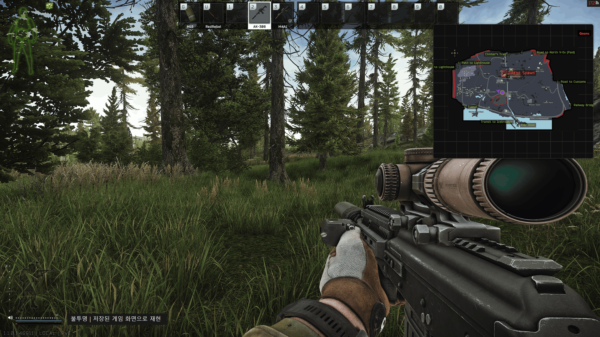
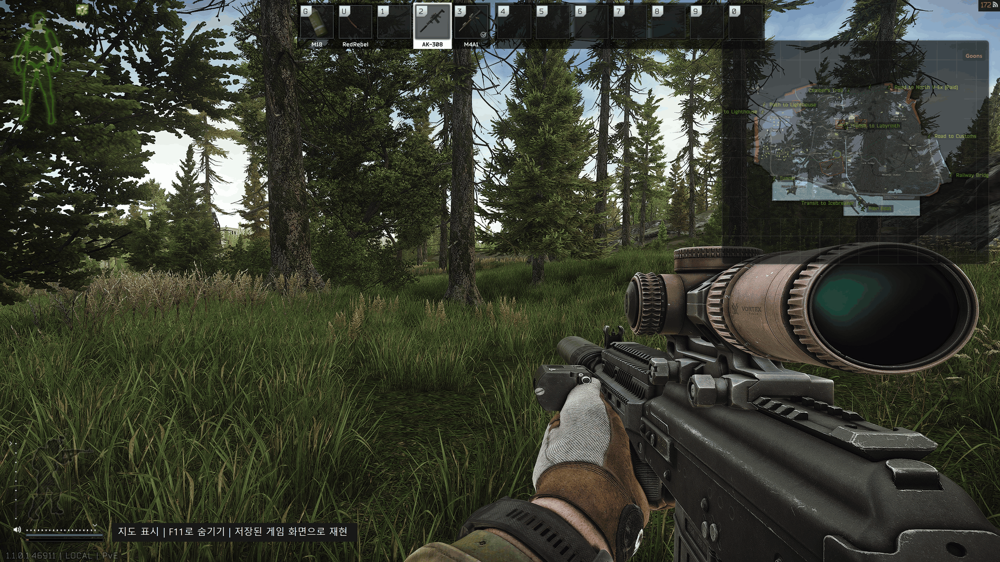
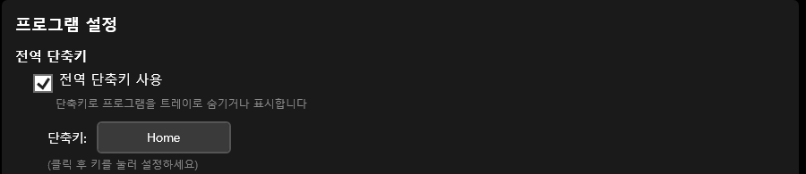
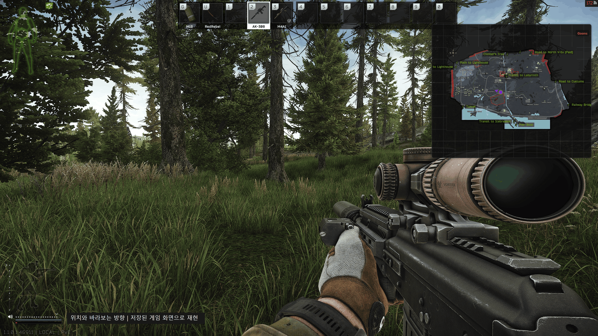
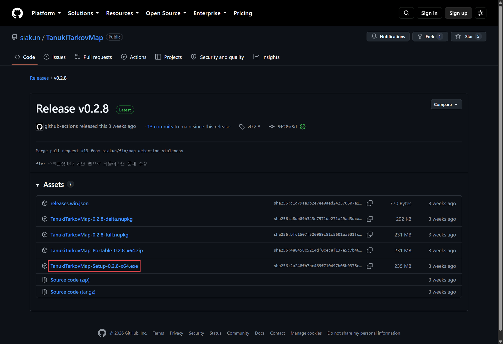
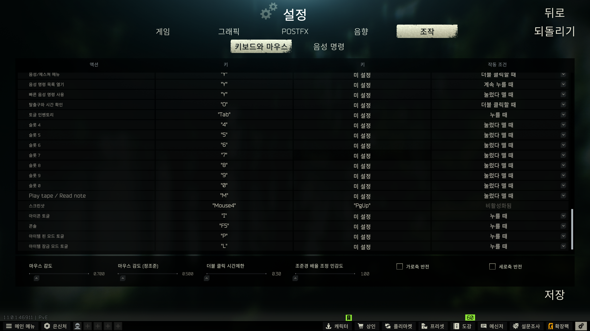

<!--
INTENT
타르코프 갤러리에서 실제로 사용할 사람에게 소개하는 게시글 초안이다. 작성자가 강조한
장점은 창 투명도와 항상 위에 고정하는 기능을 함께 써서, 특히 모니터 하나로 플레이할 때
알트탭 없이 게임과 지도를 같이 볼 수 있다는 것이다. 이를 도입과 첫 이미지의 중심에 둔다.
말투는 차분하고 진솔한 반말을 쓴다. 화난 어조나 억지 유행어로 친근함을 만들지 않는다.
제목과 본문은 '만들어봤어', '프로그램이야'처럼 말을 건네는 어미를 쓴다.
'만들어봄', '프로그램임' 같은 음슴체로 끝맺지 않는다.
독자는 이미 타르코프를 하는 갤러리 이용자다. 인사와 제품 소개부터 시작하거나 기능마다
소제목을 붙여 안내하는 구성은 피하고, 실제 화면을 놓고 필요한 설명을 이어간다.
문장 끝만 반말로 바꾸지 않는다. 모든 기능의 장점을 친절하게 풀거나 독자의 반응을
미리 짐작하는 문장을 줄이고, 만든 사람이 무엇을 구현했는지 담담하게 말한다.
작성자의 플레이 시간, 길을 잃었던 경험, 개발 계기는 확인되지 않았으므로 만들어 넣지 않는다.
개발 구조보다 사용 장면을 설명하며, 스크린샷을 찍을 때 위치와 바라보는 방향이 갱신된다는
조건을 유지한다. 지도 캡처에는 위치 점과 방향 화살표가 함께 보여야 한다.
이미지는 실제 실행 화면을 사용한다. 저장된 게임 화면과 스크린샷 파일로 앱 동작을
재현한 GIF는 재현 화면이라고 밝힌다. 위치 마커나 기능을 임의로 그려 넣지 않는다.
촬영 방법과 편집 참고 자료는 게시하지 않는 구획에 둔다.
-->

# 디시 게시글 초안

아래 제목과 본문을 사용합니다. 이미지는 본문 순서대로 원본 파일을 첨부합니다. 하단의 이미지 안내와 참고 글은 게시글에 포함하지 않습니다.

## 제목

알트탭 없이 볼 수 있는 지도 프로그램 만들어봤어

## 본문

게임 위에 지도 띄워놓고 볼 수 있게 만든 프로그램이야.
이름은 TanukiTarkovMap이야.

원모니터 쓰면 지도 보려고 알트탭을 해야 하는데
지도를 반투명하게 띄워두면 게임이랑 지도를 같이 볼 수 있어.

지도는 tarkov-market 걸 쓰고, 기존 Tarkov Client 아이디어를 참고해서 만들었어.
창 투명도 조절이랑 게임 위에 고정해두는 부분에 신경 썼는데

GIF는 저장된 게임 화면이랑 스샷 파일로 앱 동작을 재현한 거야.

이렇게 지도 뒤로 게임 화면이 보이게 해둘 수 있어.
창 크기랑 위치는 편한 대로 맞추면 되고 위쪽 핀 버튼을 켜두면 게임으로 돌아가도 지도가 앞에 남아있어.

투명도는 위쪽 오른편 슬라이더로 조절하면 되는데
마우스 빼고 게임으로 돌아가면 상단 바가 숨겨지면서 반투명해지고
다시 지도 만질 때는 불투명해져서 글씨 읽거나 확대하기 편해.

<!--
INTENT
필요할 때만 지도를 보는 사용법을 안내한다. 켜고 끈다는 표현이 앱 종료로 읽히지 않도록
트레이에 숨기는 동작을 설명하고, 키 변경 방법은 실제 설정 항목명으로 안내한다.
Home은 작성자가 텐키리스 키보드에서 마우스와 가까워 선택한 키다. 기본 단축키 F11과
개인 설정 예시를 구분하고, 어떤 키가 편한지는 자신의 키보드 배치에 맞춰 읽히게 한다.
-->

기본 단축키는 F11이고 누르면 트레이로 숨겨져. 다시 누르면 나오고.
앱은 켜둔 채로 지도 창만 숨기는 거라 길 볼 때만 잠깐 띄워도 돼.

F11이 불편하면 지도 창 위쪽 톱니바퀴를 눌러서 바꿀 수 있어.
`프로그램 설정`에서 `전역 단축키 사용`을 켜두고
`단축키` 옆에 있는 키 버튼을 클릭한 다음 쓰고 싶은 키를 누르면 돼.

나는 텐키리스라 마우스랑 가까운 Home 키로 해놨어.

게임에서 스샷 찍으면 지도에 내 위치랑 바라보는 방향이 나와.
이동하거나 보는 방향을 바꾼 다음 다시 스샷 찍으면 그 상태로 바뀌는 식이고
레이드 들어갈 때 맵도 알아서 바뀌어.

타르코프 스샷 파일 이름에 좌표가 들어있어서 그걸 읽는 거야.
맵 전환은 게임 로그를 보고, 게임 메모리를 읽거나 게임 파일을 건드리지는 않아.
코드도 깃허브에 공개해뒀으니 궁금하면 아래 링크 참고해줘.

받는 곳은 여기야.

[다운로드](https://github.com/siakun/TanukiTarkovMap/releases/latest)

윈도우 10/11 64비트용이야.
이름에 `Setup` 들어가고 `.exe`로 끝나는 파일 받아서 설치하면 되고
한번 설치하면 다음부터 업데이트는 자동으로 돼.

프로그램 켜고 게임 들어가서 F11로 지도 띄운 다음 스샷 한번 찍어봐.
스샷 기본 키는 PrtScn이고 바꿔뒀으면 그 키 쓰면 돼.

위 사진은 스샷 키를 Mouse4랑 PgUp으로 바꿔둔 예시야.

<!--
INTENT
캡처는 키 설정 화면의 예시이고, 아래 문단은 작성자가 마우스 왼쪽 버튼으로 사용해 본 경험이다.
-->
스샷 키를 마우스 왼쪽 버튼으로 해두니까
따로 스샷 찍으려고 손 안 떼도 돼서 좋더라.

스팀판은 여기만 주의해줘.
F12는 스팀 스샷이라 좌표가 안 들어가서 위치가 안 바뀌어. 게임 자체 스샷 키로 찍어야 해.
PrtScn이 안 먹으면 게임 키 설정에서 Screenshot을 다른 키로 바꿔봐.

원모니터로 하는 사람들한테 좀 도움이 됐으면 좋겠어.
버그나 불편한 거 있으면 댓글로 알려줘도 돼.
어떤 상황이었는지 같이 적어주면 확인해볼게.

써보고 괜찮다 싶으면 깃허브 스타도 한 번 눌러줘.

[소스코드와 자세한 사용법](https://github.com/siakun/TanukiTarkovMap)

---

## 이미지와 재촬영 안내 — 게시하지 않는 부분

<!--
INTENT
갤러리 첨부 용량을 줄이려고 이미지 가로 폭은 1920px 이하로 제한한다. 작은 캡처는
확대하지 않으며, GIF를 압축할 때도 상태 전환 간격과 반복은 유지한다.
대표 이미지는 README의 원본을 유지한다. 기능 설명 GIF에는 터미널로 이동하는 장면을
쓰지 않고, 지도와 방향 화살표를 알아보기 쉬운 낮 장면을 사용한다.
-->
본문에 넣은 이미지는 [이미지 폴더](images/dcinside)에 있습니다. 대표 화면은 README에 사용한 원본입니다. 투명도 비교, F11 토글, 위치와 방향 갱신 GIF는 낮 시간대 쇼어라인의 저장된 게임 화면 위에서 실제 앱을 실행해 촬영했습니다. 위치와 방향 갱신은 서로 다른 좌표와 회전값이 담긴 게임 스크린샷 파일을 앱이 읽게 해 재현했습니다. 다운로드 페이지, 게임 조작 설정, 앱의 Home 단축키 설정은 실제 화면을 캡처했습니다.

GIF는 방향 화살표 누락을 수정한 앱으로 촬영했습니다. 게시 전 다운로드할 배포본에도 이 수정이 포함돼 있는지 확인합니다.

GIF는 두 상태를 번갈아 보여주며, 플레이 과정을 연속으로 녹화한 영상은 아닙니다. 재현이라는 안내를 화면과 본문에 남겨둡니다. 아래 표는 직접 플레이한 장면으로 교체할 때 참고합니다.

첫 이미지는 게임과 지도가 한 화면에 있다는 점이 보여야 하므로 화면 전체를 담습니다. 이후 이미지는 설명하는 버튼이나 위치 마커가 읽히도록 필요한 부분을 잘라 씁니다. 투명도 비교는 같은 장소와 같은 지도 크기를 유지해 차이가 바로 보이게 합니다.

게임 자체 스크린샷에는 별도 앱인 지도 창이 담기지 않을 수 있습니다. 홍보용 이미지는 게임과 지도 창이 함께 보이는 **디스플레이 전체를 캡처하거나 녹화**합니다. 위치를 갱신하려고 누르는 게임 스크린샷 키와, 게시글에 넣을 화면을 촬영하는 작업은 구분합니다.

| 본문 자리 | 직접 캡처할 장면 | 보여줄 내용과 편집 방법 |
|---|---|---|
| 이미지 1 | 게임 화면 한쪽에 지도를 두고 핀 고정을 켠 뒤, 투명도를 조절하고 게임으로 돌아간 화면 | 상단 바가 숨겨진 상태에서 촬영. 게임 화면과 지도 글씨, 내 위치와 방향 화살표가 함께 식별되는 투명도 선택. 지도 창만 자르지 않고 게임 화면까지 포함 |
| 이미지 2 | 같은 장소에서 지도를 불투명하게 띄운 화면과 반투명하게 띄운 화면 | 두 상태를 GIF로 비교하고 각각 `불투명`, `반투명` 표시. 지도 아래 배경이 비치는 차이가 드러나는 장면 선택. 필요하면 상단 바의 핀 버튼과 투명도 슬라이더를 따로 캡처 |
| 이미지 3 | 게임을 조작하는 상태에서 F11을 눌러 지도를 숨기고, 다시 눌러 표시하는 과정 | 짧은 GIF 권장. 키를 누르는 순간에만 `F11` 자막 표시. 정지 이미지라면 같은 장면에서 `지도 숨김`, `지도 표시` 두 장 배치 |
| 이미지 4 | 앱 톱니바퀴 설정의 프로그램 설정에서 전역 단축키를 Home으로 지정한 화면 | `전역 단축키 사용` 체크와 `Home` 버튼이 함께 보이도록 해당 구역만 캡처. 게임의 스크린샷 키 설정과 구분 |
| 이미지 5 | 한 지점에서 게임 스크린샷 키를 누르고, 위치와 바라보는 방향을 바꾼 뒤 다시 눌러 갱신되는 과정 | 게임과 지도를 함께 녹화. 위치 점과 방향 화살표가 모두 보이도록 촬영하고 실제로 누른 키를 자막으로 표시. 스크린샷 없이 위치와 방향이 계속 갱신되는 것처럼 편집하지 않기 |
| 이미지 6 | 최신 릴리스 페이지의 Assets에서 Setup 설치 파일이 보이는 부분 | 받을 파일 하나에 사각형 표시. 다운로드 목록과 파일 이름이 읽히도록 확대. 페이지에 실제 표시된 파일 이름 유지 |
| 이미지 7 | 타르코프 게임 설정의 Controls에서 Screenshot과 지정된 키가 함께 보이는 부분 | 해당 행에 사각형 표시. 촬영 전에 지정된 키로 위치가 갱신되는지 확인. 기본 키와 다른 키를 사용했다면 캡션에도 실제 키 표시 |

GIF 제작이 번거로우면 전후 스크린샷만으로 구성해도 됩니다. 이미지 1은 본문의 대표 화면이고, 이미지 2는 투명화 기능을 설명하므로 둘은 우선 준비합니다. 실제 동작 화면에 기능이 추가된 것처럼 위치 마커나 지도 창을 합성하지 않습니다.

## 편집 참고 — 게시하지 않는 부분

아래 글은 표현을 복사하는 대신 화면과 설명을 배치하는 방식을 참고합니다. 기능 설명의 근거는 [README](../README.md)와 실제 캡처에 사용한 앱의 동작으로 확인합니다.

- [Where am I 2.0 업데이트](https://gall.dcinside.com/mgallery/board/view/?id=eft&no=2253700): 화면 가까이에서 조작 방법을 알려주는 친근한 설명 방식 참고.
- [Tarkov Essential 제작글](https://gall.dcinside.com/mgallery/board/view/?id=eft&no=2807153): 사용할 사람이 겪는 불편을 도입에 놓고 설치와 사용법으로 이어가는 구성 참고.
- [터미널 맵 어떤지 핑까좀](https://gall.dcinside.com/mgallery/board/view/?id=eft&no=2854156): 기능을 켜고 끈 화면의 비교 방식 참고. 말투는 이 초안의 차분한 어조 유지.
- [Tarkov Client 공유글](https://gall.dcinside.com/mgallery/board/view/?id=eft&no=2541972): 선행 도구의 소개글. 이 초안에서는 모니터 하나로 게임과 지도를 함께 보는 사용 장면에 집중.
